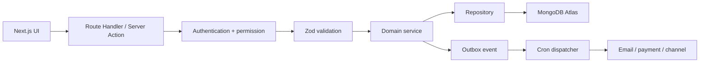
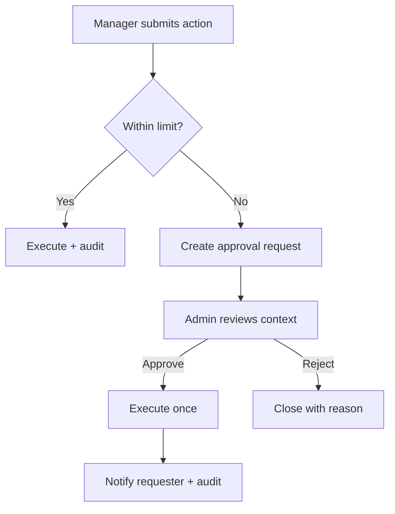
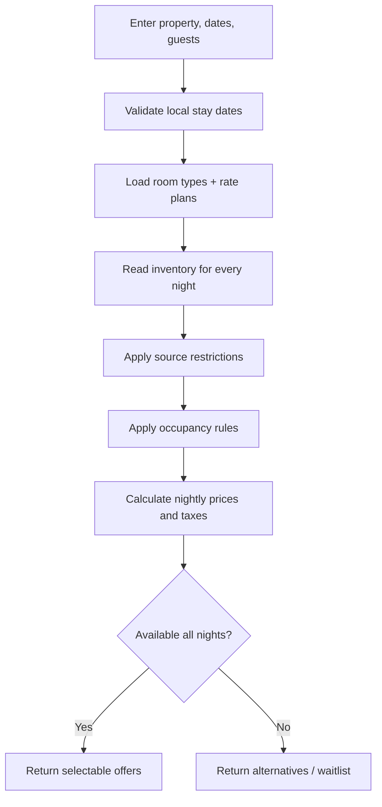
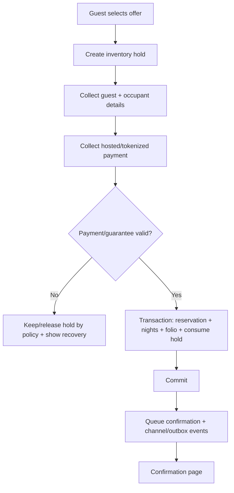
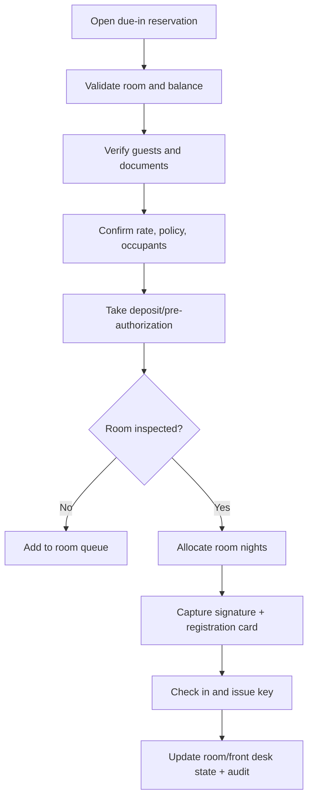
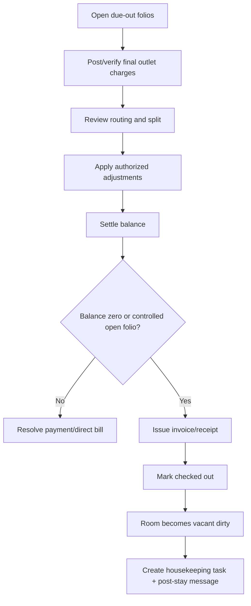
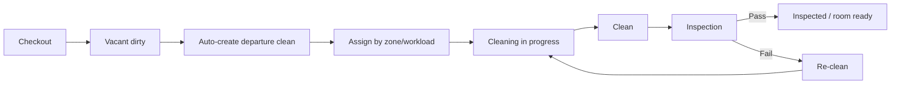
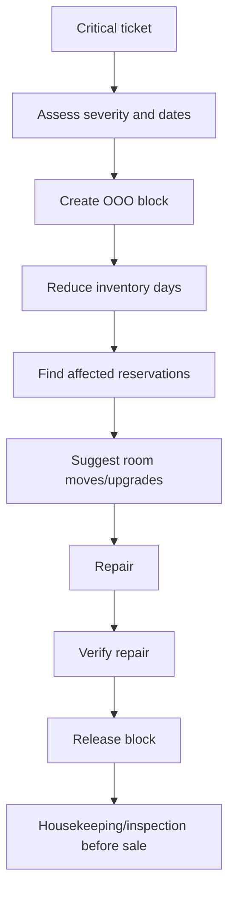
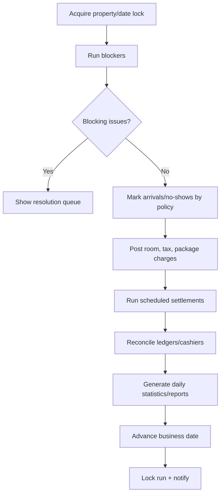

# Hotel Management System — Complete Cursor Build Specification

**Target stack:** Next.js 16 App Router, TypeScript, MongoDB Atlas, Better Auth, Tailwind CSS 4, shadcn/ui, Three.js, Anime.js 4  
**Target hosting:** Hostinger Business Web Hosting or Hostinger Cloud Hosting with Node.js Web App support  
**Primary account types:** `ADMIN` and `MANAGER`  
**Document version:** 1.0  
**Research date:** 24 July 2026  
**Purpose:** Give Cursor enough product, UX, architecture, data, workflow, testing, demo-data, and deployment direction to build a complete hotel Property Management System without guessing important business rules.

## Table of contents

1. Instructions to Cursor
2. Product vision and scope
3. Confirmed technical architecture
4. Technology stack
5. Repository and folder structure
6. Hostinger-compatible deployment architecture
7. Visual direction and design system
8. Left-side navigation specification
9. Landing page
10. Login and authentication page
11. Application shell and shared UI
12. Authentication, authorization, and approvals
13. MongoDB data architecture
14. Core business flows
15. Detailed feature modules
16. API and server contract
17. Reliable background work
18. Demo data and seed system
19. Public image catalog and media rules
20. Route and page blueprint
21. UI quality, accessibility, and motion
22. Security, privacy, and compliance
23. Testing and quality
24. Observability and operations
25. Hostinger deployment
26. Cursor implementation roadmap
27. Definition of done
28. Recommended first production scope
29. Research references
30. Final instruction to Cursor

---

# 1. Instructions to Cursor

Cursor must treat this document as the product and engineering source of truth.

## 1.1 Required working method

- Read this entire document before generating application code.
- Create the application in phases. Do not attempt to generate the whole PMS in one response or one unreviewed change.
- At the beginning of every phase:
  - Inspect the existing repository.
  - Restate the phase goal.
  - List files expected to be created or modified.
  - Identify migrations, indexes, environment variables, permissions, and tests affected.
- At the end of every phase:
  - Run TypeScript validation.
  - Run linting.
  - Run relevant unit and integration tests.
  - Build the production application.
  - Test the affected user flow in a browser.
  - Fix all errors before marking the phase complete.
- Maintain a root-level `BUILD_STATUS.md` file containing:
  - Current phase.
  - Completed features.
  - In-progress features.
  - Known limitations.
  - Required environment variables.
  - Latest test/build result.
- Maintain a root-level `DECISIONS.md` file for architectural decisions. Do not silently change a decision from this specification.
- Use feature branches and small commits when Git is available.
- Do not overwrite a working module to redesign unrelated code.
- Never expose secrets, raw payment-card data, identity documents, or real guest data in source control, seed data, logs, screenshots, or test snapshots.
- Use deterministic fictional demo data. Do not scrape or copy real guest identities.
- Keep the application runnable after every phase.

## 1.2 Cursor project rules to create

Cursor project rules live in `.cursor/rules` as `.mdc` files. Cursor's official rules documentation states that `.md` files in this folder are ignored, so use the `.mdc` extension.

Create:

```text
.cursor/rules/
  00-project-foundation.mdc
  10-nextjs-architecture.mdc
  20-ui-design-system.mdc
  30-mongodb-and-money.mdc
  40-security-and-permissions.mdc
  50-testing-and-quality.mdc
  60-hotel-domain-rules.mdc
```

### `00-project-foundation.mdc`

```md
---
alwaysApply: true
---

- Use TypeScript in strict mode.
- Use the Next.js App Router.
- Use Server Components by default and Client Components only for browser interaction.
- Keep domain logic out of React components and route handlers.
- Never weaken validation or security to make a test pass.
- Never create fake production behavior with TODO-only implementations.
- Keep BUILD_STATUS.md and DECISIONS.md updated.
- Run typecheck, lint, tests, and production build before completing a phase.
```

### `10-nextjs-architecture.mdc`

```md
---
globs: src/**/*.ts, src/**/*.tsx
alwaysApply: false
---

- Pages compose features; they do not contain database queries.
- Route handlers validate input, authenticate, authorize, call a service, and map the result.
- Domain services own transactions and business rules.
- Repositories own database access.
- Use Server Components for initial data and permission-aware rendering.
- Use TanStack Query only where live client-side refetching, optimistic updates, or background refresh is valuable.
- Never import server-only modules into Client Components.
- Do not add a custom Next.js server.
```

### `20-ui-design-system.mdc`

```md
---
globs: src/components/**/*.tsx, src/app/**/*.tsx, src/app/**/*.css
alwaysApply: false
---

- Use the design tokens defined in this build specification.
- Use Manrope for product UI and Cormorant Garamond only for selected marketing display text.
- Use shadcn/ui primitives and extend them through shared components.
- Do not hard-code colors when a semantic token exists.
- Every data screen needs loading, empty, error, success, and permission-denied states.
- Do not communicate status by color alone; include text and/or an icon.
- Preserve visible keyboard focus and full keyboard operation.
- Honor prefers-reduced-motion.
- Three.js is allowed only on the landing and authentication experience unless explicitly approved.
- Keep operational screens calm, fast, and data-first.
```

### `30-mongodb-and-money.mdc`

```md
---
globs: src/modules/**/*.ts, src/lib/db/**/*.ts, scripts/**/*.ts
alwaysApply: false
---

- Reuse one MongoClient per Node.js process.
- Use MongoDB transactions for multi-document reservation, allocation, payment, ledger, and night-audit mutations.
- Every property-owned record contains propertyId.
- Store money as integer minor units and always store currency.
- Store timestamps in UTC and hotel business dates as YYYY-MM-DD property-local dates.
- Add and verify required indexes when introducing a query.
- Never rely on a TTL deletion occurring at an exact second.
- Archive referenced master data instead of deleting it.
- Financial records are reversed; they are not rewritten or physically deleted.
```

### `40-security-and-permissions.mdc`

```md
---
alwaysApply: true
---

- Authenticate and authorize on the server for every protected mutation and data read.
- UI visibility is not authorization.
- Only ADMIN and MANAGER account types exist.
- MANAGER access is restricted by property scope, module permissions, and approval limits.
- Redact secrets, access tokens, identity-document values, and payment details from logs.
- Never store CVV or raw card numbers.
- Require reason codes for refunds, voids, discounts, write-offs, overrides, and reversals.
- Create an audit event for every sensitive or high-risk action.
- Validate webhook signatures before processing.
- Use idempotency keys for booking, payment, channel, and scheduled operations.
```

### `50-testing-and-quality.mdc`

```md
---
globs: src/**/*.ts, src/**/*.tsx, tests/**/*.ts, tests/**/*.tsx
alwaysApply: false
---

- Add unit tests for domain calculations.
- Add transaction-backed integration tests for availability, booking, room allocation, checkout, payment, and night audit.
- Add Playwright tests for complete Admin and Manager journeys.
- Add an accessibility check for every major page template.
- Include concurrency tests for the last available room.
- A test must verify behavior, not only implementation details.
- Do not mark work complete while tests are skipped without a documented reason.
```

### `60-hotel-domain-rules.mdc`

```md
---
description: Core hotel PMS rules for reservations, rooms, folios, housekeeping, maintenance, and night audit
alwaysApply: false
---

- A hotel stay occupies [arrivalDate, departureDate); departure date is not an occupied night.
- Room-type inventory is consumed before a physical room must be assigned.
- A physical room-night may have only one active allocation.
- Out-of-order blocks reduce sellable inventory for every affected stay date.
- Rate, tax, package, and policy values are snapshotted onto the reservation.
- Hotel business date is separate from system time.
- Front-office room status, housekeeping status, and maintenance status are separate state dimensions.
- A retry must never duplicate a reservation, payment, charge, invoice, or room-and-tax posting.
```

---

# 2. Product Vision and Scope

Build a modern hotel operating system, not only a booking form.

The system must connect:

- Property and room configuration.
- Room-type inventory and physical room allocation.
- Rates and selling restrictions.
- Direct, walk-in, phone, corporate, agent, group, and OTA reservations.
- Guest profiles.
- Check-in, in-house operations, and checkout.
- Housekeeping and maintenance.
- Folios, charges, payments, invoices, cashier shifts, and receivables.
- Night audit and business date.
- Guest requests, complaints, communication, and service recovery.
- Reports and operational control.

## 2.1 Initial operating scope

- One hotel must be fully usable in production.
- The database and permissions must be multi-property-ready.
- The target operating size is approximately 20–200 rooms per hotel.
- Demo mode must include two properties to prove isolation and portfolio readiness.
- Only `ADMIN` and `MANAGER` account types are allowed.
- A Manager can receive narrow or broad permission scopes without creating another top-level role.

## 2.2 Explicit scope boundary

The first production version is a PMS with hotel operations and billing. Do not allow these large optional areas to delay the PMS core:

- Full general ledger accounting.
- Payroll.
- Full restaurant ERP.
- Complex banquet/event sales.
- Native direct integrations with every OTA.
- Advanced AI pricing without human review.

Create interfaces for these future modules, but build them only in their assigned phase.

---

# 3. Confirmed Technical Architecture

## 3.1 Architecture style

Use a modular Next.js monolith.

This means:

- One Next.js application provides:
  - Marketing website.
  - Login and authentication.
  - Admin/Manager dashboard.
  - Route Handler APIs.
  - Public booking engine.
  - Protected internal cron endpoints.
- One MongoDB Atlas deployment stores operational data.
- External providers handle:
  - Payment-card collection.
  - Transactional email/SMS.
  - Object/file storage.
  - Channel management.
  - Error monitoring.

This is simpler to deploy on Hostinger than separate frontend and backend services while still preserving internal module boundaries.

## 3.2 Runtime choices

- **Node.js:** 22.x.
- **Framework:** current stable Next.js 16.x compatible with Node 22.
- **Rendering:** App Router with Server Components by default.
- **API:** Next.js Route Handlers under `/api/v1`.
- **Language:** TypeScript with `strict: true`.
- **Package manager:** npm for maximum Hostinger compatibility.
- **Build:** standard `next build`.
- **Start:** standard `next start`; no custom server.
- **Database:** MongoDB Atlas replica set.
- **ODM:** Mongoose for domain models and validation, while allowing the native driver/session where transaction control requires it.

## 3.3 Request flow



## 3.4 Server and client boundaries

Use Server Components for:

- Dashboard initial data.
- Reports initial result.
- Reservation detail.
- Guest detail.
- Permission-aware navigation.
- Admin configuration.

Use Client Components for:

- Reservation tape chart.
- Drag-and-drop room assignment with an accessible alternative.
- Live room-status board.
- Multi-step booking forms.
- Dialogs, drawers, comboboxes, and data-table interaction.
- Three.js scenes.
- Anime.js animation scopes.
- Charts with interactive filters.

Never make an entire route a Client Component merely because one widget is interactive.

## 3.5 Domain-layer contract

Every mutation must follow:

1. Authenticate the session.
2. Resolve active property.
3. Authorize account type, property scope, module permission, and financial limit.
4. Parse and validate input with Zod.
5. Load required current state.
6. Enforce domain rules.
7. Execute atomic database changes.
8. Write audit and outbox records in the same transaction where appropriate.
9. Commit.
10. Trigger or enqueue non-critical external effects.
11. Return a stable API response.

---

# 4. Technology Stack

## 4.1 Core dependencies

Use current stable compatible releases and commit `package-lock.json`.

| Area | Package/approach | Purpose |
| --- | --- | --- |
| Framework | Next.js 16 | App Router, server rendering, APIs |
| UI runtime | React version required by Next.js | Component model |
| Language | TypeScript | Type safety |
| Styling | Tailwind CSS 4 | Token-driven responsive styling |
| UI primitives | shadcn/ui + Radix primitives | Accessible dialogs, menus, forms, sidebar |
| Icons | Lucide React | Consistent stroke icons |
| Forms | React Hook Form | Performant complex forms |
| Validation | Zod | Shared server/client schemas |
| Server state | TanStack Query | Live boards and client refresh |
| Tables | TanStack Table | Data tables, sorting and columns |
| Charts | Recharts through shared chart wrappers | Operational/revenue charts |
| Database | MongoDB Atlas | Persistent PMS data |
| ODM | Mongoose | Schemas, indexes, models |
| Authentication | Better Auth + MongoDB adapter | Sessions, credentials and 2FA |
| Dates | date-fns + date-fns-tz | UTC/property timezone handling |
| Animation | Anime.js 4 | Landing, login and restrained UI motion |
| 3D | Three.js | Landing and login visual scenes |
| 3D React integration | `@react-three/fiber`, `@react-three/drei` | Maintainable Three.js scene components |
| Logging | Pino or structured JSON logger | Searchable production logs |
| Files | S3-compatible SDK/provider | Guest documents and hotel files |
| Testing | Vitest | Unit tests |
| Database testing | MongoDB test replica set | Transaction tests |
| Browser testing | Playwright | End-to-end and visual flows |
| Accessibility | axe-core Playwright integration | Automated accessibility checks |

## 4.2 Packages to avoid unless justified

- Do not install multiple component libraries.
- Do not combine Anime.js with another general animation library for the same purpose.
- Do not use a second global state manager for server data.
- Do not add Redux unless a measured requirement cannot be met by server state, URL state, and small local stores.
- Do not add a custom Express server around Next.js.
- Do not store uploaded files on Hostinger's deployed application filesystem.

## 4.3 State management

- URL query parameters:
  - Date range.
  - Property.
  - Room type.
  - Filters.
  - Search.
  - Pagination.
- Server state:
  - TanStack Query for live/refetching screens.
- Local UI state:
  - React state.
  - A small Zustand store is allowed only for cross-page interface preferences such as sidebar collapsed state or table density.
- Form state:
  - React Hook Form.
- Durable business state:
  - MongoDB only.

---

# 5. Repository and Folder Structure

```text
hotel-pms/
  .cursor/
    rules/
  docs/
    product/
    architecture/
    workflows/
  public/
    brand/
    fallback/
  scripts/
    seed/
    maintenance/
    verify-indexes/
  src/
    app/
      (marketing)/
        page.tsx
        features/
        security/
        contact/
      (auth)/
        login/
        forgot-password/
        reset-password/
        two-factor/
      (app)/
        app/
          [propertySlug]/
            dashboard/
            calendar/
            reservations/
            front-desk/
            guests/
            rooms/
            housekeeping/
            maintenance/
            requests/
            rates/
            groups/
            billing/
            night-audit/
            stock/
            reports/
            admin/
      book/
        [propertySlug]/
      manage-booking/
      api/
        auth/
        v1/
        webhooks/
        internal/
          cron/
      error.tsx
      global-error.tsx
      not-found.tsx
      layout.tsx
      globals.css
    components/
      ui/
      layout/
      data-table/
      charts/
      forms/
      marketing/
      three/
      feedback/
    config/
      navigation.ts
      permissions.ts
      feature-flags.ts
    lib/
      auth/
      db/
      errors/
      logging/
      permissions/
      validation/
      dates/
      money/
      idempotency/
      audit/
      jobs/
      storage/
    modules/
      properties/
      users/
      rooms/
      inventory/
      rates/
      reservations/
      guests/
      front-desk/
      housekeeping/
      maintenance/
      requests/
      billing/
      payments/
      cashier/
      night-audit/
      distribution/
      groups/
      companies/
      agents/
      services/
      stock/
      reports/
      notifications/
    styles/
      tokens.css
      motion.css
    types/
  tests/
    unit/
    integration/
    e2e/
    fixtures/
  BUILD_STATUS.md
  DECISIONS.md
  README.md
  next.config.ts
  package.json
  tsconfig.json
```

## 5.1 Module structure

Each domain module should use only the layers it needs:

```text
src/modules/reservations/
  reservation.model.ts
  reservation.repository.ts
  reservation.schema.ts
  reservation.service.ts
  reservation.policy.ts
  reservation.mapper.ts
  reservation.types.ts
  reservation.errors.ts
  components/
```

Rules:

- Models define persistence.
- Zod schemas define external input.
- Services own business workflows.
- Policies contain reusable permission/domain decisions.
- Repositories do not make authorization decisions.
- Components never call Mongoose directly.
- API responses use DTOs, not raw Mongo documents.

---

# 6. Hostinger-Compatible Deployment Architecture

Hostinger's current Node.js Web App support includes Next.js on Business and Cloud plans, GitHub automatic deployment, environment variables, supported Node versions including 22, and MongoDB Atlas connection setup.

## 6.1 Required Hostinger plan

Use one of:

- Business Web Hosting.
- Cloud Startup.
- Cloud Professional.
- Cloud Enterprise.
- Cloud Enterprise Plus.

Cloud Startup or above is recommended for a hotel PMS because it is a 24×7 operational application and will run server-side rendering, APIs, reports, and scheduled work.

## 6.2 Deployment approach

- Store the repository on GitHub.
- Connect Hostinger to the GitHub repository.
- Let Hostinger detect Next.js.
- Select Node.js 22.
- Install command: `npm ci`.
- Build command: `npm run build`.
- Start command: `npm run start`.
- Do not use static export because the system needs server APIs, sessions, SSR, and database operations.
- Do not use a custom Node server.
- Configure production variables in hPanel.
- Trigger deployment from the protected production branch.
- Confirm the app health endpoint and perform smoke tests after every deployment.

## 6.3 Hostinger-safe application decisions

- Treat each deployment as immutable.
- Store uploads in object storage, never local app folders.
- Store sessions and application state in MongoDB, not memory.
- Do not depend on a single in-process timer for critical work.
- Do not depend on WebSocket-only updates. Begin with polling or server-sent mechanisms that degrade safely.
- Keep a `/api/health` route that verifies application health and optionally performs a lightweight database ping.
- Use a `/api/ready` route for deeper readiness checks, protected if it reveals provider status.
- Do not expose internal cron routes publicly without a strong shared secret and replay protection.

## 6.4 Scheduled jobs

Hostinger cron schedules use UTC. Hotel schedules must remain property-timezone-aware.

Recommended pattern:

1. Hostinger cron calls a protected endpoint every minute or every five minutes.
2. The endpoint validates `CRON_SECRET`.
3. A job dispatcher queries due jobs in MongoDB.
4. It atomically leases a limited batch.
5. Each job is idempotent.
6. Success records completion.
7. Failure increments attempts and schedules retry.
8. Repeated failure enters a dead-letter state and alerts Admin.

Use this for:

- Hold cleanup/reconciliation.
- Scheduled guest messages.
- Deposit reminders.
- Report delivery.
- Rate-rule evaluation.
- Night-audit scheduling.
- Channel retry.
- Webhook retry.
- Data-retention/anonymization jobs.

Do not run a second permanent Node worker on managed hosting unless Hostinger explicitly provides and monitors it for the selected plan.

## 6.5 Environment variables

Create `.env.example` with names only:

```dotenv
NODE_ENV=
APP_URL=
APP_NAME=
DEFAULT_TIMEZONE=

MONGODB_URI=
MONGODB_DB_NAME=

BETTER_AUTH_SECRET=
BETTER_AUTH_URL=
ENCRYPTION_KEY=
CRON_SECRET=
INTERNAL_WEBHOOK_SECRET=

EMAIL_PROVIDER=
EMAIL_FROM=
EMAIL_API_KEY=

SMS_PROVIDER=
SMS_API_KEY=

PAYMENT_PROVIDER=
PAYMENT_PUBLIC_KEY=
PAYMENT_SECRET_KEY=
PAYMENT_WEBHOOK_SECRET=

OBJECT_STORAGE_ENDPOINT=
OBJECT_STORAGE_REGION=
OBJECT_STORAGE_BUCKET=
OBJECT_STORAGE_ACCESS_KEY=
OBJECT_STORAGE_SECRET_KEY=

NEXT_PUBLIC_APP_URL=
NEXT_PUBLIC_MAPS_KEY=
NEXT_PUBLIC_ANALYTICS_ID=

ERROR_MONITORING_DSN=
```

Rules:

- Never commit `.env`, `.env.local`, or production values.
- Browser-visible values must begin with `NEXT_PUBLIC_` only when safe.
- Rotate secrets after suspected exposure.
- Require redeployment when Hostinger configuration changes need it.

---

# 7. Visual Direction and Design System

## 7.1 Design concept

The product should look like a premium hospitality operations platform:

- Calm.
- Accurate.
- Warm but not decorative.
- Data-dense without feeling crowded.
- Luxurious on public pages.
- Fast and restrained inside operational pages.

Use the design concept **“Midnight Hospitality”**:

- Deep navy suggests trust and nighttime hotel operations.
- Warm champagne/brass gives hospitality character.
- Teal provides a fresh operational accent.
- Soft neutral surfaces keep large tables readable.

Do not make the dashboard look like a travel brochure. Marketing pages can be cinematic; operational screens must prioritize clarity.

## 7.2 Color tokens

### Light application theme

| Token | Value | Use |
| --- | --- | --- |
| `--background` | `#F5F7FA` | Main application background |
| `--surface` | `#FFFFFF` | Cards, dialogs, tables |
| `--surface-subtle` | `#EEF2F6` | Secondary panels |
| `--text` | `#172033` | Primary text |
| `--text-muted` | `#667085` | Secondary text |
| `--border` | `#DCE3EA` | Dividers and controls |
| `--primary` | `#173B57` | Main buttons and active state |
| `--primary-hover` | `#0F2D44` | Hover/pressed |
| `--accent` | `#C89B5D` | Premium accent, sparingly |
| `--teal` | `#0F766E` | Operational accent |
| `--success` | `#16805D` | Confirmed/ready/paid |
| `--warning` | `#A96F13` | Attention/pending |
| `--danger` | `#C2414B` | Error/overdue/critical |
| `--info` | `#2563EB` | Informational |
| `--focus` | `#3B82F6` | Keyboard focus |

### Dark navigation theme

| Token | Value |
| --- | --- |
| `--nav-bg` | `#0B1420` |
| `--nav-surface` | `#132131` |
| `--nav-text` | `#E8EEF4` |
| `--nav-muted` | `#9AABBB` |
| `--nav-active-bg` | `#1D3449` |
| `--nav-active-accent` | `#D6AE73` |

### Status colors

Every status must use color plus a word/icon:

| Domain state | Color family | Example label |
| --- | --- | --- |
| Confirmed/ready/clean/paid | Green | `Confirmed` |
| Pending/due-in/inspection | Amber | `Pending inspection` |
| In-house/active/info | Blue | `In house` |
| Cancelled/failed/critical | Red | `Payment failed` |
| Draft/inquiry/neutral | Gray | `Draft` |
| VIP/premium | Purple or brass | `VIP` |

## 7.3 Typography

Use:

- **Manrope** for the complete product UI.
- **Cormorant Garamond** only for the landing-page hero, selected marketing headings, and editorial quotes.
- System sans-serif fallback after Manrope.

Load fonts with `next/font/google` so they are optimized and self-hosted by the application build.

### Typography rules

- Dashboard body: 14–16 px.
- Public body: 16–18 px.
- Table secondary data: never below 12 px.
- Dashboard page title: 28–32 px, Manrope 650/700.
- Card title: 14–16 px, Manrope 600.
- Landing hero: responsive 52–82 px, Cormorant Garamond 600.
- Public section title: responsive 36–56 px.
- Line height:
  - Body: 1.5–1.65.
  - Heading: 1.05–1.2.
- Use `font-variant-numeric: tabular-nums` for:
  - Currency.
  - Occupancy.
  - Room numbers.
  - Folio/invoice numbers.
  - Dates and times.
- Do not use Cormorant Garamond inside tables, forms, or operational cards.
- Avoid more than four font weights in the delivered application.

## 7.4 Spacing, radius, and elevation

- Base spacing grid: 4 px.
- Common spacing: 4, 8, 12, 16, 20, 24, 32, 40, 48.
- Dashboard content padding:
  - Desktop: 24–32 px.
  - Tablet: 20–24 px.
  - Mobile: 16 px.
- Card radius: 14 px.
- Form control radius: 10 px.
- Modal/drawer radius: 18 px where viewport permits.
- Button radius: 10 px.
- Avoid excessive pill shapes; reserve pills for statuses, filters, and compact segmented controls.
- Use subtle elevation:
  - Default card: border plus minimal shadow.
  - Floating command/dialog: stronger but soft shadow.
  - Do not add a shadow to every nested container.

## 7.5 Iconography

- Use Lucide icons.
- Default operational icon: 18 px.
- Navigation icon: 19–20 px.
- Icon stroke should be consistent.
- Pair unfamiliar icons with text.
- Add tooltips for icon-only actions.
- Destructive actions must not use an icon alone in confirmation dialogs.

---

# 8. Left-Side Navigation Specification

All signed-in product navigation must appear on the left.

## 8.1 Desktop layout

- Expanded width: 272 px.
- Collapsed rail width: 80 px.
- Fixed to the left.
- Full viewport height.
- Dark navy surface.
- Product mark and property switcher at the top.
- Scrollable navigation groups in the center.
- User profile, help, collapse control, and logout at the bottom.
- Main content begins after the navigation width.
- A slim 64–72 px top bar remains within the main content for:
  - Breadcrumb.
  - Business date.
  - Global search.
  - Quick-create button.
  - Notifications.
  - User/avatar shortcut.

## 8.2 Navigation hierarchy

```text
Overview
  Dashboard
  Calendar

Reservations
  All Reservations
  New Reservation
  Waitlist & Quotes
  Groups

Front Desk
  Arrivals
  In House
  Departures
  Room Queue

Rooms & Operations
  Room Status
  Housekeeping
  Maintenance
  Guest Requests
  Lost & Found

Revenue
  Rates & Inventory
  Packages & Promotions
  Distribution Channels

Guests & Accounts
  Guest Profiles
  Companies
  Travel Agents

Finance
  Folios & Payments
  Cashier Shifts
  Accounts Receivable
  Night Audit

Hotel Operations
  Stock & Purchasing
  Staff & Handover

Reports

Administration
  Property Setup
  Users & Permissions
  Taxes & Documents
  Integrations
  Audit Log
```

## 8.3 Navigation behavior

- Show only modules the current user may access.
- Keep the active group expanded.
- Use a rounded active-row background plus a 3 px brass/teal indicator.
- When collapsed:
  - Show icons.
  - Show tooltips.
  - Opening a group displays a floating submenu.
- Save the collapsed preference per user.
- Show badges only for actionable counts:
  - Pending arrivals.
  - Room queue.
  - Unresolved critical maintenance.
  - Approvals.
- Do not show decorative notification counts.

## 8.4 Responsive behavior

- At widths below 1024 px:
  - Replace fixed sidebar with a modal drawer.
  - Keep top-bar menu button.
  - Close drawer after navigation.
- On tablets:
  - Allow a persistent collapsed rail if adequate space remains.
- On phones:
  - Use full-height drawer.
  - Place the primary quick action in the top bar or a safe floating action button.
  - Avoid a second bottom navigation that duplicates the left drawer.

## 8.5 Accessibility

- Use a semantic `<nav aria-label="Primary">`.
- Every collapse/expand action is a real button.
- Group buttons expose `aria-expanded`.
- Active route uses `aria-current="page"`.
- Focus order follows visual order.
- Escape closes mobile drawer.
- Focus returns to the menu trigger.

---

# 9. Landing Page — Stylish Three.js and Anime.js Experience

The landing page sells the product. It can be cinematic while remaining fast, accessible, and credible.

## 9.1 Page structure

1. Transparent-to-solid header.
2. Hero with Three.js scene.
3. Trust/benefit strip.
4. Product command-center preview.
5. Feature bento grid.
6. Reservation-to-checkout workflow.
7. Housekeeping and maintenance section.
8. Revenue and analytics section.
9. Security and reliability section.
10. Final CTA.
11. Footer.

## 9.2 Hero

### Content

- Eyebrow: `One operating system for every stay`.
- Main heading: `Run every room, guest and shift with calm precision.`
- Supporting copy: Explain reservations, front desk, housekeeping, billing, and reporting in one system.
- Primary CTA: `Book a product demo`.
- Secondary CTA: `Explore the platform`.
- Small trust statement: `Built for independent hotels and growing groups`.

### Three.js concept

Create a procedural scene named **“Connected Stay”**:

- A central glass-like rounded room block.
- Smaller room tiles orbit or align around it.
- Thin luminous paths connect reservation, guest, room, housekeeping, and payment nodes.
- Colors use navy, teal, and restrained champagne.
- Mouse movement creates a very small camera parallax.
- Scroll progress gently changes node arrangement.
- The scene must never reduce text contrast.

Do not download a large hotel GLTF for the first version. Use procedural geometry and lightweight materials.

### Performance budget

- Dynamically import the Three.js component with SSR disabled.
- Render a CSS gradient/poster fallback until ready.
- Maximum device pixel ratio: 1.5.
- Reduce mesh count on mobile.
- Avoid real-time shadows on mobile.
- Pause the render loop when:
  - The tab is hidden.
  - The scene is outside the viewport.
  - Reduced motion is enabled.
- Dispose geometry, material, texture, controls, and renderer on unmount.
- Keep the canvas `aria-hidden="true"` and `pointer-events: none` unless a deliberate interaction is added.
- Provide equivalent meaning in HTML; the 3D scene is decorative.

## 9.3 Anime.js motion language

Use Anime.js 4 scopes inside Client Components.

Hero sequence:

1. Header fades in: 250 ms.
2. Eyebrow moves up 10 px and fades: 450 ms.
3. Heading words reveal with 35–55 ms stagger: 650–800 ms total.
4. Body and CTAs reveal: 450 ms.
5. Product preview card settles with a gentle 12 px motion: 550 ms.

Section reveals:

- Trigger once when entering viewport.
- Use opacity plus a maximum 16 px translate.
- Stagger cards 45–70 ms.
- Avoid continuous bouncing, spinning, or excessive parallax.
- Use Anime.js timeline for coordinated sequences.
- Use Anime.js/Three.js adapter only where it materially simplifies object animation.
- Revert animation scope during component cleanup.

Reduced motion:

- Detect `prefers-reduced-motion: reduce`.
- Do not run split-text movement, parallax, continuous orbit, or scrolling transforms.
- Render final states immediately.

## 9.4 Marketing UI

- Full-width dark hero with soft radial lighting.
- Navigation remains simple: Product, Solutions, Security, Resources, Sign in, Book demo.
- Use large editorial spacing.
- Use glass effects only on selected hero overlays, not every card.
- Use real dashboard screenshots or coded product mockups, not meaningless charts.
- Feature bento cards should show:
  - Live arrivals.
  - Room availability.
  - Housekeeping priority.
  - Payment status.
  - Occupancy and RevPAR.
- CTA cards must not use fake urgency.

## 9.5 Landing acceptance criteria

- Largest Contentful Paint remains reasonable on a mid-range mobile connection.
- Page works with JavaScript/3D failure by showing fallback content.
- All content is readable without animation.
- No layout shift when fonts or canvas load.
- Keyboard users can access header and CTAs.
- Automated accessibility scan has no serious/critical violations.
- Canvas resources are released after navigation.

---

# 10. Login and Authentication Page Design

## 10.1 Layout

Desktop:

- Split-screen.
- Left visual panel: 55–58%.
- Right login panel: 42–45%.
- Left panel uses a dark gradient, a lightweight Three.js scene, hotel imagery, and a short product statement.
- Right panel uses a warm off-white surface and vertically centered form.

Tablet/mobile:

- Hide or simplify the Three.js scene.
- Use a compact brand banner.
- Form takes full width.
- Maintain at least 16 px horizontal padding.

## 10.2 Three.js login concept

Create **“Night Desk”**:

- A floating brass key-card shape.
- Three subtle translucent cards representing:
  - Arrivals.
  - Rooms ready.
  - Occupancy.
- Slow, low-amplitude drift.
- Pointer parallax only on devices with fine pointer.
- Stop animation when form input is active if performance drops.

The visual must be decorative and must not contain operational data needed to understand the page.

## 10.3 Form fields

- Email.
- Password.
- Show/hide password.
- Remember this device only if session policy allows.
- Forgot password.
- Primary `Sign in` button.
- Optional support link.
- 2FA code step after credential verification when enabled.

Do not ask the user to select Admin or Manager. Determine role from the authenticated account.

## 10.4 Login states

- Default.
- Field validation error.
- Invalid credentials using a generic message.
- Rate limited.
- Account suspended.
- Password reset required.
- 2FA challenge.
- Backup code.
- Session expired.
- Successful redirect.
- Authentication service unavailable.

## 10.5 Login motion

- Visual panel enters first.
- Form card fades/slides 12 px.
- Fields stagger 45 ms.
- Error messages appear without shaking the entire form.
- Button shows a stable loading state without changing width.
- Reduced motion renders final states.

## 10.6 Security requirements

- Better Auth with MongoDB adapter.
- Email/password accounts created by Admin invitation.
- TOTP 2FA available for Managers and required for Admin in production.
- Secure, HTTP-only, same-site cookies.
- Session rotation and revocation.
- Login throttling.
- Suspicious-login audit.
- Password reset tokens are single-use, short-lived, and stored safely.
- Never reveal whether an unknown email exists in password-reset responses.

---

# 11. Application Shell and Shared UI Patterns

## 11.1 Top bar

- Breadcrumb.
- Active property.
- Hotel business date.
- Global search.
- `New` quick-action menu.
- Notifications.
- Help.
- User menu.

The business date must be visibly different from current clock time during night operations.

## 11.2 Page header

Every page uses:

- Breadcrumb.
- Page title.
- One-sentence contextual description when useful.
- Primary action.
- Optional secondary actions.
- Filters below the header.

Do not place five equally prominent buttons in a header. Put secondary actions in an overflow menu.

## 11.3 Data tables

Shared table features:

- Sticky header.
- Search.
- Filters.
- Sort.
- Column visibility.
- Pagination.
- Row selection.
- Bulk actions.
- Saved views for complex modules.
- Density setting.
- CSV/XLSX export when permitted.
- Skeleton loading.
- Empty state with a useful next action.
- Error state with retry.
- Horizontal scroll with the key column pinned.
- Mobile card/list fallback for critical workflows.

Table rules:

- Do not truncate guest/reservation identifiers without a tooltip.
- Currency aligns right.
- Numeric columns use tabular figures.
- Actions remain keyboard accessible.
- Destructive bulk actions require confirmation and permission.

## 11.4 Forms

- Use clear labels above fields.
- Mark optional fields instead of adding an asterisk to everything.
- Group long forms into meaningful sections or steps.
- Keep booking total/policy summary visible on large screens.
- Validate on blur and submit.
- Server validation remains authoritative.
- Preserve entered values after recoverable server errors.
- Warn before abandoning dirty high-value forms.
- Use searchable comboboxes for guests, companies, rooms, rate plans, and agents.

## 11.5 Status badges

Badge content:

- Status icon or dot.
- Human-readable label.
- Optional tooltip for exact meaning.

Do not use codes such as `VC`, `VD`, or `OOO` without exposing the full term.

## 11.6 Drawers and dialogs

- Use right-side drawers for quick operational detail.
- Use full pages for complex reservation and folio editing.
- Use dialogs for short, focused actions.
- Use alert dialogs for destructive/high-risk confirmation.
- Preserve focus.
- Escape closes only when doing so is safe.

## 11.7 Feedback

- Toast: non-blocking success.
- Inline alert: validation or module-specific issue.
- Banner: system/channel outage.
- Modal: high-risk decision.
- Activity timeline: long-running workflow.
- Never rely only on a toast for payment or booking failure.

## 11.8 Charts

- Keep chart colors semantic and accessible.
- Always include exact values in tooltip/table.
- Allow comparison period.
- Do not use 3D charts.
- Do not use pie charts with many categories.
- Revenue values must state gross/net and currency.
- Metric definition should be available through an info tooltip.

---

# 12. Authentication, Authorization, and Approvals

## 12.1 Account types

Only:

```ts
type AccountType = "ADMIN" | "MANAGER";
```

Do not create `RECEPTIONIST`, `HOUSEKEEPER`, `ACCOUNTANT`, or other top-level account types.

A Manager's effective access is calculated from:

- Account status.
- Assigned properties.
- Module permissions.
- Action permissions.
- Financial limits.
- Data sensitivity permissions.
- Approval requirements.

## 12.2 User-access record

Keep application authorization separate from the authentication provider's basic user record.

Suggested fields:

```ts
interface UserAccess {
  authUserId: string;
  accountType: "ADMIN" | "MANAGER";
  status: "INVITED" | "ACTIVE" | "SUSPENDED";
  propertyIds: string[];
  permissionPreset?: string;
  permissions: string[];
  approvalLimits: {
    maxDiscountPercent: number;
    maxRefundMinor: number;
    maxRateOverridePercent: number;
    maxWriteOffMinor: number;
  };
  requireTwoFactor: boolean;
  lastPropertyId?: string;
}
```

## 12.3 Permission naming

Use explicit names:

```text
dashboard.view
reservation.view
reservation.create
reservation.modify
reservation.cancel
reservation.no_show
reservation.reinstate
front_desk.check_in
front_desk.check_out
front_desk.room_move
guest.view
guest.view_sensitive
guest.export
housekeeping.manage
maintenance.manage
rates.view
rates.update
rates.override
billing.view
billing.post_charge
billing.take_payment
billing.refund
billing.void
cashier.open
cashier.close
night_audit.run
reports.operational
reports.financial
reports.export
admin.property
admin.users
admin.integrations
audit.view
```

## 12.4 Authorization function

Create one server-side policy API:

```ts
authorize({
  session,
  propertyId,
  permission: "billing.refund",
  amountMinor,
});
```

The function returns:

- Allowed.
- Denied with stable reason.
- Requires approval.

Do not scatter role checks such as `if (user.role === "ADMIN")` throughout components.

## 12.5 Approval workflow

Use for:

- Discount above Manager limit.
- Refund above Manager limit.
- Rate override beyond permitted range.
- Complimentary room/service.
- Write-off.
- Reopening a closed business date.
- Tax exemption.
- Large stock adjustment.
- Sensitive guest-profile merge.

Flow:



Approval record:

- Requester.
- Property.
- Action type.
- Target record.
- Current value.
- Proposed value.
- Reason.
- Amount/percentage.
- Supporting attachment.
- Status.
- Reviewer.
- Decision reason.
- Expiry.
- Idempotency key.

## 12.6 Demo users

Development/demo only:

| Account | Type | Properties | Scenario |
| --- | --- | --- | --- |
| `admin@aureliastay.example` | ADMIN | All | Full owner access |
| `manager.kolkata@aureliastay.example` | MANAGER | Kolkata | Broad operations |
| `manager.goals@aureliastay.example` | MANAGER | Goa | Broad operations |
| `finance.manager@aureliastay.example` | MANAGER | Kolkata | Billing/reports only |
| `ops.manager@aureliastay.example` | MANAGER | Kolkata | Front desk/rooms only |

Use a clearly documented demo password loaded from a non-production seed environment variable. Force seed credentials off in production.

---

# 13. MongoDB Data Architecture

## 13.1 Core modeling principles

- Use references between major aggregates.
- Embed immutable snapshots and small bounded arrays.
- Do not embed unbounded transaction, message, or stay history inside a guest or reservation document.
- Every property-owned document includes `propertyId`.
- Use string/UUID-style public identifiers and Mongo `_id` internally.
- Every mutable document includes:
  - `createdAt`.
  - `updatedAt`.
  - `createdBy`.
  - `updatedBy`.
  - Optional `version`.
- Referenced configuration is archived, not deleted.

## 13.2 Date and time model

Store:

- Instant events as UTC `Date`:
  - Login.
  - Payment event.
  - Check-in time.
  - Message sent.
- Hotel stay dates as property-local `YYYY-MM-DD`:
  - Arrival date.
  - Departure date.
  - Inventory date.
  - Business date.
- Time-of-day settings with timezone:
  - Check-in time.
  - Checkout time.
  - Night-audit schedule.

Never calculate stay nights by dividing milliseconds because daylight-saving and timezone transitions can produce errors.

## 13.3 Money model

Use integer minor units:

```ts
interface Money {
  amountMinor: number;
  currency: string;
}
```

Examples:

- INR ₹4,500.00 → `450000`.
- USD $149.95 → `14995`.

Rules:

- Never use JavaScript floating point for financial totals.
- Define rounding per currency/tax rule.
- Snapshot currency and exchange rate when conversion occurs.
- Record gross, discount, net, tax, and total separately.

## 13.4 Primary collections

### Organization and access

- `properties`
- `buildings`
- `floors`
- `userAccess`
- Better Auth collections
- `staffRecords`
- `permissionPresets`

### Room and inventory

- `roomTypes`
- `rooms`
- `roomInventoryDays`
- `roomBlocks`
- `bookingHolds`
- `roomNightAssignments`

### Rates and distribution

- `ratePlans`
- `rateCalendarDays`
- `restrictionDays`
- `packages`
- `promotions`
- `channelMappings`
- `channelEvents`

### Reservation and guest

- `reservations`
- `reservationRooms`
- `reservationNights`
- `guests`
- `occupants`
- `guestPreferences`
- `guestConsents`
- `companies`
- `travelAgents`
- `groups`
- `groupAllotmentDays`

### Operations

- `housekeepingTasks`
- `roomInspections`
- `maintenanceTickets`
- `assets`
- `preventiveSchedules`
- `guestRequests`
- `complaints`
- `lostAndFound`

### Finance

- `folios`
- `folioTransactions`
- `payments`
- `paymentAllocations`
- `invoices`
- `cashierShifts`
- `accountsReceivable`
- `ledgerEntries`
- `commissions`
- `numberSequences`

### Platform control

- `businessDates`
- `nightAuditRuns`
- `approvalRequests`
- `auditEvents`
- `outboxEvents`
- `jobs`
- `notifications`
- `messageDeliveries`
- `idempotencyRecords`
- `integrationCredentialsMetadata`

## 13.5 Room-type inventory day

Create one document per room type per stay date:

```ts
interface RoomInventoryDay {
  propertyId: ObjectId;
  roomTypeId: ObjectId;
  date: string;
  physicalTotal: number;
  outOfOrder: number;
  protected: number;
  groupHeld: number;
  groupPickedUp: number;
  confirmed: number;
  tentative: number;
  activeHolds: number;
  overbookingLimit: number;
  version: number;
}
```

Unique index:

```text
{ propertyId: 1, roomTypeId: 1, date: 1 } unique
```

Sellable remaining:

```text
physicalTotal
- outOfOrder
- protected
- confirmed
- countedTentative
- activeHolds
- unpickedGroupHeld
+ overbookingLimit
```

The system must define whether tentative inventory and group-held inventory count for each search source.

## 13.6 Booking holds

Fields:

- `holdToken`.
- Property.
- Requested room type and quantity.
- Stay dates.
- Guest/session fingerprint.
- Price snapshot.
- Created time.
- Expiry time.
- Status: `ACTIVE`, `CONSUMED`, `EXPIRED`, `RELEASED`.

Use a TTL index for cleanup, but never rely on TTL deletion timing for availability. Every availability query and hold conversion must treat `expiresAt <= now` as inactive.

When creating a hold:

- Start transaction.
- Update each affected `roomInventoryDay` only if remaining availability is sufficient.
- Increment `activeHolds`.
- Create hold.
- Commit.

When consuming/releasing:

- Update all inventory days.
- Change status exactly once.
- Use idempotency.

## 13.7 Physical room-night assignments

Create one document per room per occupied date:

```ts
interface RoomNightAssignment {
  propertyId: ObjectId;
  roomId: ObjectId;
  date: string;
  reservationId: ObjectId;
  reservationRoomId: ObjectId;
  status: "ACTIVE" | "RELEASED";
}
```

Use a unique partial index on active assignments:

```text
{ propertyId: 1, roomId: 1, date: 1 } unique where status = ACTIVE
```

This makes a physical double assignment impossible even if two requests race.

## 13.8 Reservation aggregate

Reservation fields:

- Public confirmation number.
- Property.
- Status.
- Booking source/channel/market/segment.
- Booker guest.
- Contact.
- Arrival/departure.
- Total adults/children.
- Reservation-room IDs.
- Company/agent/group links.
- Guarantee status.
- Deposit policy snapshot.
- Cancellation policy snapshot.
- Currency.
- Quoted/booked total snapshot.
- Payment status summary.
- Special requests summary.
- Check-in/out timestamps.
- Cancellation/no-show details.
- Source reference.
- Version.

Keep detailed nightly prices in `reservationNights` to avoid an unbounded, frequently rewritten reservation document.

## 13.9 Folio and ledger

- A folio groups financial transactions for presentation.
- `folioTransactions` is append-oriented.
- A correction creates a linked reversal and replacement.
- Every transaction states:
  - Business date.
  - Posting UTC timestamp.
  - Property.
  - Folio.
  - Type.
  - Charge code.
  - Net.
  - Tax.
  - Gross.
  - Currency.
  - Source.
  - Parent/reversal link.
  - User/system actor.
- Ledger entries are balanced according to the application's configured accounting export model.
- Do not physically delete posted transactions.

## 13.10 Number sequences

Use atomic counters per:

- Property.
- Document type.
- Fiscal year or configured period.

Examples:

- Reservation: `KOL-RES-2026-004182`.
- Invoice: `KOL-INV-26-000984`.
- Maintenance: `KOL-MNT-000214`.

Sequence allocation happens in the same transaction as record creation where possible.

## 13.11 Essential indexes

At minimum:

- Reservation confirmation unique per property.
- Reservation source reference unique per property/source when present.
- Reservation search by property + status + arrival/departure.
- Guest normalized email and phone.
- Room unique by property + room number.
- Room type code unique by property.
- Inventory unique day index.
- Room-night assignment active unique index.
- Booking hold TTL and status/expiry.
- Folio transaction by folio + posting time.
- Invoice number unique per property.
- Payment provider event ID unique.
- Channel event external ID unique.
- Idempotency scope + key unique.
- Jobs by status + runAt.
- Audit by property + createdAt + action.
- Message deliveries by status + scheduledAt.

Create a script that compares expected indexes with database indexes during deployment verification.

## 13.12 Transaction requirements

Use MongoDB transactions for:

- Create/consume/release booking hold across multiple dates.
- Confirm reservation and consume inventory.
- Change stay dates or room type.
- Cancel/reinstate/no-show.
- Allocate/move physical room across multiple nights.
- Payment plus folio allocation.
- Checkout settlement.
- Invoice numbering and issue.
- Night-audit room-and-tax posting.
- Critical room block that changes inventory.

Keep transactions short:

- Perform external API calls before or after, not inside a database transaction.
- Revalidate external results through idempotency.
- Avoid loading unnecessary documents.
- Handle transient transaction errors using the driver-supported retry pattern.

---

# 14. Core Business Flows

## 14.1 Availability search



Detailed rules:

- Arrival must be before departure.
- Stay uses `[arrivalDate, departureDate)`.
- Requested occupancy must fit room-type policy.
- A room type is available only if every occupied night is available.
- The maximum sellable quantity is the minimum remaining quantity across the stay.
- Rate plan must be open and pass:
  - Booking window.
  - Min/max stay.
  - Closed-to-arrival.
  - Closed-to-departure.
  - Stop sell.
  - Source/channel eligibility.
- Price response includes:
  - Nightly base rate.
  - Occupancy supplements.
  - Package.
  - Discount.
  - Taxes/fees.
  - Total.
  - Deposit and cancellation summary.

## 14.2 Direct booking



Failure handling:

- Payment succeeds but reservation commit fails:
  - Record reconciliation event.
  - Retry confirmation only if safe.
  - Otherwise flag refund/manual review.
  - Do not ask guest to pay again without clear status.
- Reservation commits but email fails:
  - Keep reservation.
  - Retry notification.
- Browser retries:
  - Use booking idempotency key.
  - Return original result.

## 14.3 Manager reservation

Steps:

1. Search guest or create a minimal profile.
2. Search availability.
3. Select one or multiple rooms/rate plans.
4. Add occupants, source, company/agent/group, notes, and special requests.
5. Apply deposit/cancellation rule.
6. Add transport and services.
7. Review price.
8. Take guarantee/deposit.
9. Confirm.
10. Send confirmation.

Manager-specific options:

- Save inquiry/quote.
- Place temporary option.
- Add to waitlist.
- Override within permission.
- Request approval above limit.

## 14.4 Check-in



Rules:

- Do not check in to dirty or out-of-order room without explicit controlled exception.
- Validate room capacity.
- Validate no physical room-night conflict.
- Record actual arrival time.
- Identity-document access must be logged.
- If early check-in fee is waived, capture reason/approval.

## 14.5 Room move

Steps:

1. Choose effective date/time.
2. Search eligible physical rooms.
3. Check all remaining room nights.
4. Calculate rate impact.
5. Decide whether rate changes or original rate is retained.
6. Create new assignment segments.
7. Release old remaining assignments.
8. Update housekeeping status for old and new room.
9. Reissue key.
10. Record reason and notify relevant teams.

## 14.6 Checkout



Rules:

- Checkout is blocked by unresolved balance unless authorized open folio/direct billing exists.
- Final invoice values must reconcile to folio.
- Room state and housekeeping task change in the same reliable workflow.
- Never mark payment complete from a browser redirect alone; verify provider state/webhook.

## 14.7 Housekeeping turnover



## 14.8 Maintenance room block



## 14.9 Payment and webhook

1. Create internal payment attempt with idempotency key.
2. Create provider payment/order.
3. Guest/customer completes hosted payment.
4. Provider sends signed webhook.
5. Verify signature and event uniqueness.
6. Map provider status to internal state.
7. In transaction:
   - Update payment.
   - Add folio payment transaction.
   - Allocate amount.
   - Write audit/outbox.
8. Return success to provider quickly.
9. Reconcile scheduled settlement later.

## 14.10 Night audit



Every step:

- Has a stable step key.
- Records start/end/status.
- Is idempotent.
- Can be retried safely.
- Cannot post duplicate room and tax.

---

# 15. Detailed Feature Modules

Every module below must include:

- Permission-aware routes.
- Loading, empty, error, success, and no-access states.
- Audit events for meaningful mutations.
- Property isolation.
- Demo data.
- Unit/integration tests for domain rules.

## 15.1 Hotel Command Center

### Purpose

Give a Manager the hotel's current operational truth without opening multiple reports.

### Main screen

- Header:
  - Property.
  - Business date.
  - Current time.
  - Shift.
  - Last refreshed.
- KPI row:
  - Occupancy.
  - Rooms sold.
  - ADR.
  - RevPAR.
  - Room revenue.
  - Outstanding balance.
- Operations row:
  - Arrivals.
  - Departures.
  - In house.
  - Room queue.
  - Vacant clean.
  - Vacant dirty.
  - Out of order.
- Action center:
  - Unassigned arrivals.
  - Rooms not ready.
  - Payment failures.
  - High balances.
  - Critical maintenance.
  - Channel sync failures.
  - Night-audit blockers.
- Activity timeline:
  - Recent check-ins.
  - Checkouts.
  - Room moves.
  - Payments.
  - Overrides.

### Interaction

- Clicking a KPI opens its filtered record list.
- Filters persist in URL.
- Auto-refresh every 30–60 seconds while visible.
- Pause refresh while a user is editing a modal.
- Show stale-data indicator if refresh fails.

### Demo data

- One busy weekday at 76% occupancy.
- One near-sold-out weekend at 96%.
- 14 arrivals, 11 departures, 51 in house.
- 4 rooms awaiting cleaning.
- 2 room-queue guests.
- 1 payment failure.
- 1 critical maintenance issue.
- 2 pending approvals.

### Acceptance

- Every displayed number reconciles with a drill-down list.
- Managers see only assigned property.
- Dashboard remains useful at 320 px width.

## 15.2 Property Setup and Master Data

### Purpose

Configure the legal, physical, operational, and commercial identity of a hotel.

### Screens

- Property profile.
- Buildings/floors/zones.
- Policies.
- Taxes and charge codes.
- Payment methods.
- Number sequences.
- Templates.
- Master lists.

### Flow

1. Admin creates property.
2. Enters timezone, currency, check-in/out times, tax identifiers, business-date rules.
3. Creates buildings/floors.
4. Creates room types and physical rooms.
5. Creates rate/tax/policy masters.
6. Runs setup validation.
7. Activates property for booking.

### Rules

- Property cannot become bookable until:
  - Timezone exists.
  - Currency exists.
  - At least one room type and physical room exist.
  - Tax/fee behavior is defined.
  - Default rate plan exists.
  - Invoice sequence exists.
- Referenced master items are archived, not deleted.
- Configuration changes have effective dates where historical impact exists.

### Demo data

- `Aurelia Grand Kolkata`.
- `Aurelia Bay Resort Goa`.
- Full addresses using clearly fictional/demo markers.
- INR base currency.
- Asia/Kolkata timezone.
- Check-in 14:00; checkout 11:00.

## 15.3 Room Type and Physical Room Management

### Screens

- Room-type card grid.
- Room-type editor.
- Physical room table.
- Room detail.
- Connecting-room map.
- Bulk room import.

### Room-type form

- Code and name.
- Public description.
- Capacity and child-age rules.
- Bed configuration.
- Amenities.
- Size and view.
- Images.
- Cleaning credits.
- Upgrade relationships.
- Active/sellable state.

### Physical-room form

- Room number.
- Building/floor/zone.
- Room type.
- Accessibility.
- Smoking policy.
- Features.
- Connecting room.
- Operational notes.
- Current statuses.

### Demo data

Kolkata, 72 rooms:

| Room type | Count | Base occupancy | Max occupancy |
| --- | ---: | ---: | ---: |
| Deluxe Queen | 24 | 2 | 3 |
| Deluxe Twin | 16 | 2 | 3 |
| Premier King | 12 | 2 | 3 |
| Executive Suite | 8 | 2 | 4 |
| Family Room | 8 | 4 | 5 |
| Accessible King | 4 | 2 | 2 |

Goa, 48 rooms:

- Garden King: 16.
- Pool View King: 12.
- Lagoon Twin: 8.
- Ocean Suite: 8.
- Family Villa: 4.

### Acceptance

- Duplicate room number within a property is rejected.
- Archived room type remains visible in historical reservations.
- Changing room type recalculates future inventory deliberately, not silently.

## 15.4 Availability and Inventory

### Screens

- Availability search.
- Room-type inventory grid.
- Occupancy heatmap.
- Sell restrictions.
- Holds.
- Inventory reconciliation.
- Oversell exceptions.

### Manager flow

1. Select dates and occupancy.
2. See available room types and rates.
3. Expand nightly breakdown.
4. Select offer.
5. Create hold/reservation.

### Admin flow

1. Open inventory grid.
2. Bulk-select dates.
3. Update protection, overbooking, stop sell, or restrictions.
4. Preview affected channels/rates.
5. Confirm with reason.

### Rules

- No boolean availability on room.
- Every stay night must be available.
- Expired holds are ignored even before TTL cleanup.
- Multi-date inventory mutation uses transaction.
- Overbooking is explicit, limited, and audited.
- Inventory reconciliation compares counters with source reservation/hold/block records.

### Demo data

- 180 inventory days for every room type.
- Festival high-demand dates.
- A sold-out date.
- A low-demand weekday.
- Group block.
- Maintenance block.
- Two active checkout holds.
- One expired hold awaiting TTL cleanup.

### Acceptance

- 20 concurrent attempts for one remaining room produce exactly one confirmation.
- Cancellation restores the correct dates and quantity.
- OOO block changes availability immediately.

## 15.5 Rate and Revenue Management

### Screens

- Rate-plan list/editor.
- Rate calendar.
- Restriction calendar.
- Promotion builder.
- Revenue dashboard.
- Pickup and pace report.

### Rate plans

- BAR Flexible.
- BAR Breakfast.
- Advance Purchase.
- Corporate Negotiated.
- Long Stay.
- Group.
- Day Use.
- Mobile Direct.

### Rate update flow

1. Select property, room type, rate plan, dates, and weekdays.
2. Enter fixed price or parent-rate adjustment.
3. Configure occupancy supplements/restrictions.
4. Preview calculated nights.
5. Show minimum/maximum guardrail warnings.
6. Save and publish.
7. Queue channel updates.

### Rules

- Rate plan may derive from one parent only; prevent cycles.
- Store rate in minor units.
- Preserve booked nightly snapshot.
- Source/channel-specific price must remain traceable to base price and adjustment.
- Manual override needs reason; beyond limit needs approval.

### Demo data

- 365 daily rates.
- Weekday/weekend difference.
- Durga Puja event pricing for Kolkata.
- Winter holiday pricing for Goa.
- Early booking, mobile direct, and stay-3-pay-2 promotions.
- Two corporate negotiated plans.

## 15.6 Reservation Management

### Screens

- All reservations.
- Reservation workspace.
- New reservation wizard.
- Quotes.
- Waitlist.
- Cancellation/no-show dialog.
- Reservation activity.

### Reservation workspace tabs

- Overview.
- Rooms and occupants.
- Stay and rate.
- Folios.
- Payments.
- Requests/traces.
- Communication.
- Documents.
- Activity.

### Create flow

1. Source and dates.
2. Availability and rate.
3. Guest/booker.
4. Occupants.
5. Extras and requests.
6. Guarantee/deposit.
7. Review.
8. Confirm/send.

### Modification flow

- Load current version.
- Preview change.
- Recheck availability.
- Show price/policy difference.
- Select reprice or retain if permitted.
- Save transactionally.
- Notify guest and channel where required.

### Demo data

- At least 220 reservations:
  - 35 past checked out.
  - 45 in house/current.
  - 55 future confirmed.
  - 15 due in.
  - 12 due out.
  - 18 cancelled.
  - 8 no show.
  - 10 inquiries/quotes.
  - 8 waitlist.
  - 14 group-linked.
- Sources:
  - Direct web.
  - Walk-in.
  - Phone.
  - Corporate.
  - Travel agent.
  - Booking.com demo mapping.
  - Expedia demo mapping.
  - Agoda demo mapping.

### Acceptance

- Date changes update inventory exactly once.
- Cancellation policy snapshot calculates correct penalty.
- Source webhook retry cannot duplicate booking.

## 15.7 Reservation Calendar and Tape Chart

### UI

- Physical rooms as rows.
- Stay dates as columns.
- Sticky room column and date header.
- Reservation bars.
- Unassigned lane.
- OOO/OOS blocks.
- Group overlays.
- Status legend.

### Interactions

- Click blank range to start booking.
- Drag booking to another eligible room.
- Resize to change stay.
- Open quick drawer.
- Use context menu for common operations.

### Accessible alternative

Every drag operation has a dialog-based alternative:

- Select reservation.
- Choose action.
- Choose new room/dates.
- Preview conflict/price.
- Confirm.

### Performance

- Virtualize rows and long date ranges.
- Fetch only visible window plus buffer.
- Optimistically show move only after server accepts.
- Roll back on conflict.

### Demo data

- Back-to-back stays.
- Split stay.
- Scheduled room move.
- Connecting-room family.
- OOO block.
- Unassigned reservation.
- Group room block.

## 15.8 Front Desk

### Routes

- Arrivals.
- In house.
- Departures.
- Room queue.
- Walk-in.
- Shift handover.

### Arrivals

- Filters: arrival time, room readiness, VIP, payment, group.
- Quick pre-assign.
- Missing document/balance indicators.
- Batch group check-in.

### In house

- Search room/guest.
- Extend stay.
- Room move.
- Post charge.
- Add sharer.
- Guest request.
- High-balance alert.

### Departures

- Balance.
- folio readiness.
- transport.
- late checkout.
- checkout.

### Demo data

- Early arrival waiting.
- VIP repeat guest.
- Corporate direct bill.
- Family needing connecting rooms.
- Guest with late checkout.
- Guest with unpaid balance.
- Group batch check-in.

## 15.9 Guest Profiles and CRM

### Screens

- Guest search/list.
- Guest profile.
- Duplicate review.
- Consent center.
- Guest segment reports.

### Profile tabs

- Summary.
- Stays.
- Preferences.
- Spend.
- Messages.
- Requests/complaints.
- Documents.
- Consent/privacy.
- Activity.

### Rules

- Normalize email/phone for matching.
- Duplicate merge requires preview.
- Sensitive documents are masked.
- Marketing requires appropriate consent.
- Internal notes have sensitivity levels.
- Data-retention/anonymization job preserves legally required financial history.

### Demo data

- 150 fictional guests.
- Indian and international profiles.
- Repeat guests.
- VIP.
- Corporate traveler.
- Family.
- Accessibility need.
- Dietary preference.
- Marketing opted in/out.
- Duplicate candidate.
- Document-expiry reminder.

## 15.10 Housekeeping

### Screens

- Live room board.
- My/assigned tasks.
- Supervisor allocation.
- Inspection.
- Linen and supplies.
- Lost and found.
- Productivity.

### Board filters

- Floor/zone.
- Room type.
- Front-office state.
- Housekeeping state.
- Arrival/departure/stayover.
- Assignee.
- Priority.

### Task workflow

- Created.
- Assigned.
- Accepted.
- In progress.
- Clean.
- Inspection pending.
- Re-clean.
- Inspected.
- Closed.

### Rules

- Checkout automatically produces departure clean.
- Room cannot become sell-ready until required inspection passes.
- DND handling follows configured escalation.
- Housekeeping and front-office discrepancy is visible immediately.
- Critical damage creates maintenance ticket and optional OOO block.

### Demo data

- 45 tasks across floors.
- 6 room attendants as non-login staff records.
- 2 supervisors.
- Departure, stayover, deep clean, turndown, and re-clean tasks.
- 2 DND rooms.
- 1 sleep discrepancy.
- 1 skip discrepancy.
- 4 lost-and-found items.

## 15.11 Maintenance and Engineering

### Screens

- Ticket board.
- Ticket detail.
- Asset register.
- Preventive calendar.
- Room downtime.
- Vendor/cost report.

### Ticket fields

- Category.
- Location/room.
- Asset.
- Priority.
- Safety/guest impact.
- Description.
- Photos.
- Assignee/vendor.
- SLA.
- Parts/labor.
- Resolution and verification.

### Rules

- Critical guest-room issue can create OOO block.
- OOO block dates update inventory transactionally.
- Room is not automatically released only because ticket says completed; verification and cleaning may still be needed.
- Repeat fault indicator appears after configured recurrence.

### Demo data

- 28 tickets:
  - 4 critical/high.
  - 9 in progress.
  - 5 waiting for parts.
  - 10 completed.
- HVAC, plumbing, electrical, Wi-Fi, lock, furniture, and appliance examples.
- 40 assets.
- 12 preventive schedules.
- 2 OOO rooms.

## 15.12 Guest Requests, Complaints, and Service Recovery

### Screens

- Request inbox.
- SLA board.
- Request detail/timeline.
- Complaint dashboard.
- Service-recovery approval.

### Flow

1. Create from guest, reservation, room, QR/self-service, message, or phone.
2. Categorize and prioritize.
3. Assign.
4. Acknowledge guest.
5. Work and update.
6. Complete.
7. Confirm satisfaction.
8. Reopen/escalate if needed.

### Rules

- Complaint monetary recovery uses approval limits.
- Critical safety/security categories immediately alert Admin/Manager.
- Guest-visible notes are separated from internal notes.

### Demo data

- 35 requests.
- Extra towel, luggage, airport transfer, wake-up, room service, Wi-Fi, noise, cleanliness, and AC.
- 6 complaints with different severities.
- 3 service-recovery actions.

## 15.13 Billing, Folios, Taxes, and Payments

### Screens

- Folio workspace.
- Post charge.
- Split/routing.
- Payment.
- Refund.
- Invoice.
- Payment reconciliation.
- Transaction journal.

### Folio workspace

- Summary balance.
- Multiple folio tabs.
- Line-item ledger.
- Charge/payment filters.
- Split/route action.
- Settlement panel.
- Invoice history.
- Audit timeline.

### Rules

- Charge codes drive tax and revenue department.
- Posted line is never deleted.
- Void/reversal creates opposite entry linked to original.
- Refund cannot exceed eligible captured amount.
- Payment-provider status is authoritative.
- Invoice number is unique and immutable.
- Tax snapshot remains unchanged after issue.

### Demo data

- Room charge.
- Breakfast.
- Minibar.
- Laundry.
- Airport pickup.
- Spa.
- Late checkout.
- Discount.
- Tax.
- Deposit.
- Card payment.
- Cash.
- UPI.
- Direct bill.
- Partial refund.
- Failed payment.
- Split company/guest folio.

## 15.14 Night Audit

### Screen

- Current business date.
- Audit readiness score.
- Blocking issues.
- Warning issues.
- Step timeline.
- Run/continue/retry controls.
- Generated report pack.

### Pre-audit blockers

- Due-ins unresolved.
- Due-outs unresolved.
- Open cashiers.
- Unbalanced folios.
- Failed outlet/channel imports.
- Scheduled room move incomplete.
- Ledger mismatch.

### Demo data

- One clean historical audit.
- One current date with:
  - 2 unresolved arrivals.
  - 1 due-out balance.
  - 1 open cashier.
  - 1 room discrepancy warning.
- A simulated failed report-delivery step that can safely retry.

### Acceptance

- Double-click or request retry cannot duplicate postings.
- Only one audit lock exists per property/business date.
- Business date advances exactly once.

## 15.15 Direct Booking Engine

### Public routes

- Search.
- Room/rate results.
- Offer details.
- Guest details.
- Extras.
- Payment.
- Confirmation.
- Manage booking.

### UX

- Mobile-first.
- Persistent booking summary.
- Transparent nightly price.
- Clear cancellation/deposit rules before payment.
- Compare room types.
- Multi-room booking.
- Promo code.
- Add-on upsell.
- Secure payment.

### Demo data

- Six Kolkata room types and five Goa room types.
- Three public rates each.
- Images and amenities.
- Promo codes:
  - `DIRECT10`.
  - `STAY3`.
  - `EARLYBIRD`.
- Airport pickup, breakfast, extra bed, late checkout, spa credit.

### Acceptance

- Search remains usable without 3D/marketing JavaScript.
- Hold expiry is visible and accurate.
- Confirmation can be retrieved after refresh.
- Manage-booking access uses secure, expiring verification.

## 15.16 Distribution and Channel Management

### Screens

- Provider connection.
- Room/rate mapping.
- Sync health.
- Event log.
- Reconciliation.
- Rate/inventory comparison.

### Rules

- Integrate an established channel manager first.
- New/modified/cancelled booking events are idempotent.
- Mapping errors enter review queue.
- Source reference is unique.
- Failed outbound ARI updates retry.
- Optionally enable safety stop-sell after sustained unhealthy synchronization.

### Demo data

- Sandbox providers named Booking.com, Expedia, Agoda, and direct.
- Simulated successful booking.
- Duplicate webhook.
- Mapping failure.
- Cancelled reservation.
- Rate sync rejection.
- Recovery after retry.

## 15.17 Groups, Corporate Accounts, and Travel Agents

### Group screens

- Group profile.
- Block calendar.
- Allotment by room type/date.
- Rooming list.
- Pickup.
- Master folio.
- Group check-in/out.

### Corporate screens

- Company.
- Contacts.
- Negotiated rate.
- Credit/direct bill.
- Production.

### Agent screens

- Agent profile.
- Commission rule.
- Reservation production.
- Commission statement.

### Demo data

- Groups:
  - `Eastern Medical Summit`.
  - `Sen–Rao Wedding`.
  - `Indigo Crew Rotation`.
- Companies:
  - 12 fictional companies using `.example` domains.
- Agents:
  - 8 fictional agencies.
- One block near cutoff.
- One rooming-list import.
- One master-folio routing example.

## 15.18 Point of Sale and Ancillary Services

### Phase scope

First implement:

- Service catalog.
- Manual/outlet charge posting.
- Room charge authorization.
- Basic outlet settlement integration.

Do not build a full restaurant kitchen system in the PMS MVP.

### Services

- Breakfast.
- Restaurant.
- Bar.
- Minibar.
- Laundry.
- Spa.
- Transport.
- Parking.
- Meeting space.
- Early/late checkout.

### Demo data

- 40 service items.
- Prices, tax codes, departments, availability, and images where useful.
- Package-included breakfast.
- Minibar consumption.
- Laundry charge.
- Spa appointment placeholder.

## 15.19 Stock, Purchasing, and Cost Control

### Screens

- Item master.
- Store stock.
- Transactions.
- Count.
- Reorder.
- Suppliers.
- Purchase request/order/receipt.

### Rules

- Every adjustment has reason.
- Negative stock behavior is configured.
- Unit conversion is explicit.
- Batch/expiry enabled only for relevant items.
- Posting source links back to housekeeping, minibar, maintenance, or outlet.

### Demo data

- 80 items:
  - Linen.
  - Toiletries.
  - Cleaning materials.
  - Minibar.
  - Maintenance spares.
  - Office supplies.
- 10 suppliers.
- 4 low-stock alerts.
- 2 pending POs.
- 1 physical-count variance.

## 15.20 Staff, Shifts, and Handover

### Scope

Staff records do not need login accounts.

### Features

- Directory.
- Department.
- Shift roster.
- Task assignment.
- Handover notes.
- Cashier assignment.
- Active/inactive.

### Demo data

- 24 staff records across front office, housekeeping, maintenance, finance, F&B, and management.
- Morning, evening, and night shifts.
- Three unresolved handover notes.

## 15.21 Communication Center

### Screens

- Guest conversation.
- Template editor.
- Scheduled messages.
- Delivery status.
- Failed queue.
- Consent.

### Events

- Confirmation.
- Modification.
- Cancellation.
- Deposit due.
- Pre-arrival.
- Online check-in.
- Room ready.
- In-stay welcome.
- Request update.
- Checkout.
- Invoice.
- Review request.

### Rules

- Template variables are validated before activation.
- Quiet hours use guest/property timezone.
- Transactional and marketing consent are separate.
- Delivery failure does not rollback reservation.
- Replies attach to guest/reservation timeline where supported.

### Demo data

- 16 templates.
- English, Hindi, and Bengali sample variants where appropriate.
- Delivered, queued, bounced, failed, and opted-out examples.

## 15.22 Task and Automation Engine

### Automation builder

- Trigger.
- Conditions.
- Actions.
- Delay.
- Property scope.
- Status.
- Test/dry run.
- Execution history.

### Initial supported triggers

- Reservation confirmed/cancelled.
- Deposit due.
- Arrival approaching.
- Check-in.
- Checkout.
- Room status changed.
- Maintenance ticket created.
- Payment failed.
- Night audit completed.
- Inventory threshold crossed.

### Safety

- Idempotency.
- Execution limit.
- Recursion prevention.
- Preview.
- Pause.
- Dead-letter.
- Approval for high-impact actions.

### Demo data

- Auto-create checkout clean.
- Pre-arrival message 48 hours before.
- Deposit reminder 72 hours before due.
- High-balance Manager alert.
- Critical maintenance escalation.
- Daily manager report.

## 15.23 Reports and Analytics

### Report groups

- Operations.
- Reservations.
- Revenue.
- Finance.
- Housekeeping.
- Maintenance.
- Guests.
- Channels.
- Stock.
- Audit.

### Shared behavior

- Date and business-date mode.
- Property.
- Comparison period.
- Drill-down.
- Export.
- Schedule.
- Permission filtering.
- Metric definition.

### Required KPI definitions

- Occupancy:
  - Define whether out-of-order rooms are excluded from available-room denominator.
- ADR:
  - Room revenue divided by rooms sold.
- RevPAR:
  - Room revenue divided by available rooms.
- TRevPAR:
  - Total revenue divided by available rooms.
- Cancellation rate.
- No-show rate.
- Average length of stay.
- Booking window.
- Pickup/pace.

Define formulas in one metrics module and test them.

### Demo data

- 12 months of summarized historical records or generated source transactions.
- Seasonal trend.
- Direct/OTA mix.
- Budget comparison.
- Housekeeping turnaround distribution.
- Maintenance SLA trend.

## 15.24 Admin Console

### Sections

- Properties.
- Users and permissions.
- Master data.
- Rates/policies/taxes.
- Number sequences.
- Templates.
- Integrations.
- Jobs.
- Imports/exports.
- Audit.
- Security.
- Data retention.

### Rules

- Integration secrets are write-only after save.
- Permission change invalidates/re-evaluates sessions as needed.
- Import has preview and rollback strategy.
- Dangerous action displays exact target and impact.
- Configuration changes are auditable.

### Demo data

- Two permission presets:
  - Operations Manager.
  - Finance Manager.
- Five pending/decided approvals.
- Integration health examples.
- Import preview with two invalid rows.

## 15.25 Multi-Property Readiness

### Features

- Property switcher.
- Portfolio dashboard.
- Central guest search with authorization.
- Cross-property availability.
- Transfer reservation.
- Central company/agent records.
- Consolidated reports.
- Property-specific business date, currency, taxes, and templates.

### Rules

- Every query starts with authorized property scope.
- Cross-property reports require explicit permission.
- Transferring reservation is a coordinated cancel/rebook or dedicated transaction with a clear audit trail.
- Never reuse one property's room/rate identifiers in another property context.

### Demo data

- Kolkata and Goa properties.
- One Admin with both.
- Managers restricted to one.
- One corporate account common to both.
- One cross-property repeat guest.

---

# 16. API and Server Contract

The browser is never trusted with pricing, inventory, permissions, payment status, or audit fields. The UI may calculate a preview for responsiveness, but the server recalculates and validates the final result.

## 16.1 API conventions

- Use `/api/v1` for public or integration-facing endpoints.
- Prefer Server Actions for tightly coupled internal form mutations, but call the same domain services used by Route Handlers.
- Use JSON request and response bodies except for uploads and exports.
- Return ISO 8601 timestamps in UTC and include the property's IANA time zone where business-day meaning matters.
- Store money as integer minor units and expose both:
  - `amountMinor: 125000`
  - `currency: "INR"`
  - an optional server-formatted `displayAmount: "₹1,250.00"` for reports or documents.
- Every mutation accepts or creates:
  - `requestId`
  - authenticated `actorId`
  - `propertyId`
  - `source`
  - `idempotencyKey` when a retry could duplicate financial or booking activity.
- Collections use opaque identifiers. Do not expose sequential database IDs.
- Use cursor pagination for large operational lists and page-number pagination only for reports where page numbers are meaningful.
- Every list endpoint supports a documented, allow-listed sort order. Never pass arbitrary client fields into MongoDB sort or filter objects.
- Validate all input at the boundary with Zod and validate important domain invariants again inside the service.

## 16.2 Response envelope

Successful single record:

```json
{
  "data": {
    "id": "res_01K...",
    "status": "CONFIRMED"
  },
  "meta": {
    "requestId": "req_01K...",
    "version": 4
  }
}
```

Successful list:

```json
{
  "data": [],
  "meta": {
    "requestId": "req_01K...",
    "nextCursor": null,
    "total": 0,
    "filters": {}
  }
}
```

Error:

```json
{
  "data": null,
  "error": {
    "code": "INVENTORY_NO_LONGER_AVAILABLE",
    "message": "The Deluxe King is no longer available for one of the selected nights.",
    "fieldErrors": {
      "roomTypeId": ["Choose another room type or date range."]
    },
    "retryable": false
  },
  "meta": {
    "requestId": "req_01K..."
  }
}
```

## 16.3 Standard error codes

| Code | HTTP | UI behavior |
|---|---:|---|
| `VALIDATION_ERROR` | 422 | Keep form values and show field errors |
| `UNAUTHENTICATED` | 401 | Redirect to login and preserve safe return URL |
| `FORBIDDEN` | 403 | Show permission explanation, never hide the audit event |
| `NOT_FOUND` | 404 | Show scoped not-found state |
| `VERSION_CONFLICT` | 409 | Offer refresh and display what changed |
| `INVENTORY_NO_LONGER_AVAILABLE` | 409 | Preserve search and show alternatives |
| `ROOM_NOT_READY` | 409 | Offer override request if policy allows |
| `FOLIO_NOT_SETTLED` | 409 | Open balance summary |
| `BUSINESS_DATE_LOCKED` | 423 | Prevent posting and explain night-audit state |
| `IDEMPOTENCY_CONFLICT` | 409 | Retrieve original result rather than duplicate it |
| `RATE_LIMITED` | 429 | Disable retry briefly and show remaining wait |
| `INTEGRATION_UNAVAILABLE` | 503 | Queue safe work or present manual fallback |

## 16.4 Concurrency contract

- Add an integer `version` to mutable aggregates such as reservations, rooms, folios, and work orders.
- Send the version in mutations or use `If-Match`.
- Update with `{ _id, propertyId, version }` and increment the version atomically.
- If the update matches zero documents:
  - fetch the current record;
  - return `VERSION_CONFLICT`;
  - let the user review the current value instead of silently overwriting another staff member's work.
- Inventory sale and assignment use their dedicated atomic/transactional paths, not generic CRUD.
- A payment, refund, reversal, reservation creation, and check-in request must be idempotent.

## 16.5 API route map

The list is intentionally explicit so Cursor creates a coherent API instead of scattered one-off endpoints.

### Authentication and session

- `POST /api/auth/*` — Better Auth handler.
- `GET /api/v1/session/context` — actor, authorized properties, active property, business date, permissions.
- `POST /api/v1/session/active-property` — change active property after authorization.
- `POST /api/v1/session/reauthenticate` — step-up verification before a sensitive action.

### Property and room setup

- `GET|POST /api/v1/properties`
- `GET|PATCH /api/v1/properties/:propertyId`
- `GET|POST /api/v1/properties/:propertyId/room-types`
- `GET|PATCH /api/v1/properties/:propertyId/room-types/:roomTypeId`
- `GET|POST /api/v1/properties/:propertyId/rooms`
- `GET|PATCH /api/v1/properties/:propertyId/rooms/:roomId`
- `POST /api/v1/properties/:propertyId/rooms/:roomId/status-transition`
- `GET|POST /api/v1/properties/:propertyId/amenities`
- `GET|POST /api/v1/properties/:propertyId/taxes`

### Availability, inventory, and rates

- `POST /api/v1/availability/search`
- `POST /api/v1/availability/holds`
- `POST /api/v1/availability/holds/:holdId/confirm`
- `DELETE /api/v1/availability/holds/:holdId`
- `GET|PATCH /api/v1/inventory/calendar`
- `POST /api/v1/inventory/bulk-adjust`
- `GET|POST /api/v1/rate-plans`
- `GET|PATCH /api/v1/rate-plans/:ratePlanId`
- `GET|PATCH /api/v1/rates/calendar`
- `POST /api/v1/rates/bulk-adjust`
- `POST /api/v1/rates/quote`

### Reservations and groups

- `GET|POST /api/v1/reservations`
- `GET|PATCH /api/v1/reservations/:reservationId`
- `POST /api/v1/reservations/:reservationId/confirm`
- `POST /api/v1/reservations/:reservationId/cancel`
- `POST /api/v1/reservations/:reservationId/reinstate`
- `POST /api/v1/reservations/:reservationId/no-show`
- `POST /api/v1/reservations/:reservationId/assign-room`
- `POST /api/v1/reservations/:reservationId/move-room`
- `POST /api/v1/reservations/:reservationId/add-companion`
- `GET|POST /api/v1/groups`
- `POST /api/v1/groups/:groupId/rooming-list/import`
- `POST /api/v1/groups/:groupId/pickup`

### Front desk and guests

- `GET /api/v1/front-desk/arrivals`
- `GET /api/v1/front-desk/departures`
- `GET /api/v1/front-desk/in-house`
- `POST /api/v1/front-desk/check-in`
- `POST /api/v1/front-desk/check-out`
- `POST /api/v1/front-desk/key-issued`
- `GET|POST /api/v1/guests`
- `GET|PATCH /api/v1/guests/:guestId`
- `POST /api/v1/guests/:guestId/merge`
- `POST /api/v1/guests/:guestId/consents`
- `POST /api/v1/guests/:guestId/documents`

### Housekeeping, maintenance, and requests

- `GET /api/v1/housekeeping/board`
- `POST /api/v1/housekeeping/tasks`
- `POST /api/v1/housekeeping/tasks/:taskId/assign`
- `POST /api/v1/housekeeping/tasks/:taskId/transition`
- `POST /api/v1/housekeeping/inspections`
- `GET|POST /api/v1/work-orders`
- `GET|PATCH /api/v1/work-orders/:workOrderId`
- `POST /api/v1/work-orders/:workOrderId/transition`
- `GET|POST /api/v1/guest-requests`
- `POST /api/v1/guest-requests/:requestId/transition`

### Folios, payments, and cashiering

- `GET /api/v1/folios/:folioId`
- `POST /api/v1/folios/:folioId/charges`
- `POST /api/v1/folios/:folioId/payments`
- `POST /api/v1/folios/:folioId/refunds`
- `POST /api/v1/folios/:folioId/voids`
- `POST /api/v1/folios/:folioId/adjustments`
- `POST /api/v1/folios/:folioId/transfer`
- `POST /api/v1/folios/:folioId/split`
- `POST /api/v1/folios/:folioId/close`
- `GET|POST /api/v1/cashier/shifts`
- `POST /api/v1/cashier/shifts/:shiftId/close`
- `GET /api/v1/invoices/:invoiceId/document`

### Night audit and reporting

- `GET /api/v1/night-audit/readiness`
- `POST /api/v1/night-audit/runs`
- `GET /api/v1/night-audit/runs/:runId`
- `POST /api/v1/night-audit/runs/:runId/resume`
- `GET /api/v1/reports/catalog`
- `POST /api/v1/reports/run`
- `POST /api/v1/reports/export`
- `POST /api/v1/reports/schedules`

### Admin and integrations

- `GET|POST /api/v1/admin/users`
- `PATCH /api/v1/admin/users/:userId/access`
- `GET|POST /api/v1/admin/approvals`
- `POST /api/v1/admin/approvals/:approvalId/decide`
- `GET /api/v1/admin/audit-events`
- `GET /api/v1/admin/jobs`
- `POST /api/v1/admin/jobs/:jobId/retry`
- `GET|POST /api/v1/admin/integrations`
- `POST /api/v1/admin/imports/preview`
- `POST /api/v1/admin/imports/:importId/commit`

### Public booking engine and webhooks

- `POST /api/v1/public/availability`
- `POST /api/v1/public/holds`
- `POST /api/v1/public/reservations`
- `GET /api/v1/public/reservations/:publicToken`
- `POST /api/v1/public/reservations/:publicToken/cancel`
- `POST /api/v1/webhooks/payments/:provider`
- `POST /api/v1/webhooks/channels/:provider`
- `POST /api/v1/internal/cron/dispatch`

## 16.6 Search, filters, and exports

- Debounce text search, but submit filters immediately when operational urgency benefits.
- Persist safe filter state in the URL so the user can bookmark or share a view.
- Saved views are property-scoped and can be private or shared.
- Exports always:
  - re-check the user's permission;
  - apply property scope;
  - record filters and row count;
  - mask protected fields when the permission does not allow full data;
  - run asynchronously for large data sets;
  - expire download URLs.

## 16.7 Upload and import contract

- Allow-list MIME types and extensions.
- Generate storage keys on the server; never trust the uploaded filename as a path.
- Limit size by category.
- Virus-scan when an appropriate scanning service is configured.
- Store guest documents in private object storage, never `/public`.
- CSV import flow:
  1. Upload.
  2. Detect columns.
  3. Let the user map columns.
  4. Parse into a staging collection.
  5. Validate every row.
  6. Show a preview with error reasons.
  7. Require explicit commit.
  8. Write in bounded batches.
  9. Provide a result report and rollback strategy where feasible.

---

# 17. Reliable Background Work

Hostinger cron is a trigger, not the job system. Durable state lives in MongoDB so a process restart does not lose work.

## 17.1 Transactional outbox

When a business action must cause later work, write the domain change and an outbox event in the same transaction.

```ts
type OutboxEvent = {
  _id: string;
  propertyId: string;
  type:
    | "RESERVATION_CONFIRMED"
    | "RESERVATION_CANCELLED"
    | "CHECKED_IN"
    | "CHECKED_OUT"
    | "PAYMENT_CAPTURED"
    | "ROOM_STATUS_CHANGED"
    | "NIGHT_AUDIT_COMPLETED";
  aggregateType: string;
  aggregateId: string;
  payload: Record<string, unknown>;
  createdAt: Date;
  publishedAt?: Date;
  attempts: number;
  nextAttemptAt: Date;
};
```

Examples:

- Reservation confirmed → confirmation email, pre-arrival workflow, channel sync, analytics projection.
- Room marked inspected → arrival assignment readiness refresh.
- Payment captured → receipt and ledger projection.
- Night audit completed → daily reports and management digest.

## 17.2 Durable job model

```ts
type Job = {
  _id: string;
  propertyId?: string;
  type: string;
  deduplicationKey?: string;
  payload: Record<string, unknown>;
  status: "QUEUED" | "RUNNING" | "SUCCEEDED" | "RETRY_WAIT" | "DEAD";
  priority: number;
  attempt: number;
  maxAttempts: number;
  runAfter: Date;
  lockedBy?: string;
  lockedUntil?: Date;
  lastError?: {
    code: string;
    message: string;
    at: Date;
  };
  createdAt: Date;
  completedAt?: Date;
};
```

Worker rules:

- Claim work using an atomic `findOneAndUpdate`.
- Apply a lease with `lockedUntil`; expired leases can be reclaimed.
- Keep handlers idempotent.
- Use exponential backoff with jitter for retryable failures.
- Move permanently failed jobs to `DEAD`.
- Admin can inspect and retry dead jobs after resolving the cause.
- Never log raw credentials, full payment data, or guest documents in job payloads.

## 17.3 Cron dispatcher

- Configure one Hostinger cron request at an appropriate interval, such as every five minutes.
- The route verifies:
  - `Authorization: Bearer <CRON_SECRET>`;
  - a timestamp window;
  - optionally an HMAC signature.
- The route:
  1. Releases stale leases.
  2. Creates due scheduled jobs with deduplication keys.
  3. Claims a bounded number of jobs.
  4. Executes within a strict time budget.
  5. Returns counts, not sensitive results.
- All schedules are stored with an IANA property time zone.
- Remember that Hostinger's cron configuration uses UTC; translate property-local schedules before enqueueing.

## 17.4 Scheduled jobs

- Expire booking holds.
- Send pre-arrival and post-stay messages.
- Identify expected arrivals/departures.
- Mark configurable no-show candidates for review.
- Create daily housekeeping tasks.
- Recalculate dashboard projections.
- Retry integration events.
- Produce scheduled reports.
- Purge expired sessions and temporary exports.
- Apply retention and anonymization policies.
- Check SSL/integration/channel health.
- Never auto-run night audit without explicit property configuration and readiness safeguards.

## 17.5 Admin job monitor

Show:

- Queue depth by type.
- Oldest queued age.
- Success/failure rate.
- Retry count.
- Dead-letter count.
- Last dispatcher heartbeat.
- Integration-specific failures.
- Filters by property, type, state, and date.
- Redacted payload preview.
- Retry, cancel-if-safe, and download-diagnostics actions.

---

# 18. Demo Data and Seed System

Demo data is a first-class product feature. Every route, filter, chart, state, and report must have meaningful data on first launch.

## 18.1 Seed guarantees

- Use deterministic seed `20260724`.
- Use a configurable `baseBusinessDate`, defaulting to the date when the seed command runs.
- Derive all relative dates from `baseBusinessDate`; do not let the demo become stale.
- Use fictional names and `.example` email domains.
- Use clearly invalid demonstration phone numbers.
- Prefix generated third-party references with `DEMO-`.
- Put demo media URLs in one catalog.
- Mark seeded records with:

```ts
{
  demo: true,
  seedVersion: "1.0.0",
  seedKey: "kolkata-reservation-arrival-001"
}
```

- `npm run seed:demo` is repeatable and does not duplicate data.
- `npm run seed:reset` requires a typed confirmation and only removes documents where `demo: true`.
- Refuse to run the seed command when `NODE_ENV === "production"` unless `ALLOW_DEMO_SEED_IN_PRODUCTION=true` is explicitly set.

## 18.2 Seed volume

| Segment | Kolkata | Goa | Purpose |
|---|---:|---:|---|
| Room types | 6 | 5 | Different capacities and pricing |
| Physical rooms | 72 | 48 | Operational floor/wing views |
| Rate plans | 8 | 7 | Refundable, breakfast, corporate, package |
| Inventory days | 400 days/type | 400 days/type | Past and future reporting |
| Guest profiles | 180 | 100 | Search, deduplication, repeat stays |
| Reservations | 260 | 160 | Every lifecycle state |
| Group blocks | 5 | 3 | Pickup and release flows |
| Companies/agents | 12 | 8 | Negotiated rates and AR |
| Folios | 220 | 130 | Open, closed, split, transferred |
| Payments/refunds | 260 | 150 | Cash, card token, UPI, bank |
| Housekeeping tasks | 95 | 65 | Today, backlog, inspections |
| Work orders | 32 | 21 | Priority and SLA variety |
| Guest requests | 48 | 30 | New through resolved |
| Stock items | 75 | 55 | Min/max and expiry examples |
| Purchase orders | 16 | 10 | Draft through received |
| Staff profiles | 38 | 26 | Departments, shifts, leave |
| Audit events | 650 | 380 | Searchable operational history |
| Jobs/outbox events | 70 | 45 | Success, retry, dead-letter states |

These volumes are large enough to test pagination and charts while remaining quick to seed.

## 18.3 Property seeds

### Property A — Meridian Grand Kolkata

- Type: city business hotel.
- Time zone: `Asia/Kolkata`.
- Currency: `INR`.
- Business day cutover: 04:00 local.
- Address: fictional Park Street area address.
- 72 rooms across floors 2–9.
- Room types:
  - Superior Queen — 18 rooms, 2 adults.
  - Deluxe King — 20 rooms, 2 adults + 1 child.
  - Executive Twin — 12 rooms, 2 adults.
  - Club King — 10 rooms, lounge access.
  - Junior Suite — 8 rooms.
  - Meridian Suite — 4 rooms.
- Outlets:
  - Amber Table restaurant.
  - Atrium Café.
  - Azure Spa.
  - Meeting rooms: Victoria, Howrah, Maidan.

### Property B — Meridian Cove Goa

- Type: beach resort.
- Time zone: `Asia/Kolkata`.
- Currency: `INR`.
- Business day cutover: 04:00 local.
- 48 rooms across garden, pool, and sea-view wings.
- Room types:
  - Garden Room — 12.
  - Pool View King — 12.
  - Sea View King — 12.
  - Family Suite — 8.
  - Cove Villa — 4.
- Outlets:
  - Tide Kitchen.
  - Sunset Bar.
  - Cove Spa.
  - Water-sports desk.

## 18.4 Room seed matrix

Every room has:

- room number;
- floor/wing;
- room type;
- bed type;
- connecting-room reference where applicable;
- accessibility flags;
- smoking policy;
- operational status;
- housekeeping state;
- occupancy state;
- last cleaned/inspected times;
- maintenance notes;
- features such as high floor, quiet side, near elevator, sea view, bathtub, balcony.

Ensure useful exceptions exist:

- Two connecting-room pairs.
- Four accessible rooms.
- One room out of order for seven days.
- One room out of service for a minor repair.
- Three rooms due for deep cleaning.
- One room with a conflicting “away from elevator” guest preference to test assignment scoring.

## 18.5 Rate-plan seeds

Create these patterns:

- Best Available Rate — flexible cancellation.
- Advance Purchase — 15% lower, non-refundable.
- Breakfast Included — per-room breakfast package.
- Corporate Apex — negotiated weekday price and company eligibility.
- Long Stay 7+ — length-of-stay discount.
- Weekend Escape — Friday/Saturday package.
- Honeymoon Package — Goa only, inclusions and package image.
- Group Convention — linked to a group block.

For each plan seed:

- name and public description;
- internal code;
- booking window;
- stay date range;
- occupancy rules;
- meal plan;
- cancellation and no-show policy;
- deposit schedule;
- derived-rate relationship;
- channel eligibility;
- room-type price grid;
- min/max length of stay;
- closed-to-arrival/departure examples;
- one intentionally inactive old plan for filtering.

## 18.6 Reservation scenario library

Seed at least the following named scenarios so developers and QA can find them:

1. `DEMO-ARRIVAL-CLEAN-READY`
   - Confirmed direct reservation.
   - Room assigned and inspected.
   - Deposit paid.
   - No blockers.

2. `DEMO-ARRIVAL-ROOM-DIRTY`
   - VIP arrival in 45 minutes.
   - Assigned room still dirty.
   - High-priority housekeeping task.
   - Dashboard alert.

3. `DEMO-WALKIN-UNASSIGNED`
   - Same-day walk-in quote.
   - No room assigned until check-in.

4. `DEMO-GROUP-PICKUP`
   - Reservation linked to a wedding block.
   - Company pays room and breakfast; guest pays extras.

5. `DEMO-CORPORATE-AR`
   - Negotiated company rate.
   - Approved direct billing.

6. `DEMO-NONREF-CANCEL`
   - Non-refundable reservation requesting cancellation.
   - Manager approval needed for waiver.

7. `DEMO-NOSHOW-CANDIDATE`
   - Arrival date passed.
   - No check-in or cancellation.
   - Deposit and policy visible.

8. `DEMO-INHOUSE-ROOM-MOVE`
   - In-house guest reports air-conditioning issue.
   - Open work order.
   - Suggested same-type and upgraded room alternatives.

9. `DEMO-LATE-CHECKOUT`
   - Approved 15:00 checkout.
   - Housekeeping board and next arrival warn of tight turnaround.

10. `DEMO-FOLIO-DISPUTE`
    - Guest disputes minibar charge.
    - Adjustment requires approval.

11. `DEMO-SPLIT-FOLIO`
    - Guest and company windows with routed charge categories.

12. `DEMO-CHANNEL-MODIFIED`
    - OTA reservation updated twice.
    - External references and event history.

13. `DEMO-OVERBOOK-RISK`
    - One room type has zero remaining physical buffer and a maintenance risk.

14. `DEMO-ACCESSIBLE-PREFERENCE`
    - Accessibility need is a hard assignment requirement.

15. `DEMO-CHECKEDOUT-REFUND`
    - Closed folio with a post-stay partial refund and audit trail.

## 18.7 Guest-profile seeds

Include:

- first-time, repeat, VIP, corporate traveler, family, couple, and group organizer;
- multiple nationalities and languages;
- birthdays and anniversaries stored with appropriate privacy controls;
- dietary, accessibility, pillow, bed, and room-location preferences;
- consent granted, denied, withdrawn, and unknown;
- one do-not-rent restricted profile with reason permission;
- three likely duplicate pairs for merge testing;
- one profile with an expired document;
- one profile with a scheduled future data-erasure review;
- stay histories with realistic average spend and channel mix.

Never seed real passport numbers, payment card numbers, or government identifiers.

## 18.8 Housekeeping seeds

Distribute today's 72 Kolkata rooms across:

- 16 occupied clean.
- 13 occupied service due.
- 9 vacant clean.
- 8 vacant inspected.
- 11 dirty departures.
- 4 cleaning in progress.
- 3 inspection required.
- 2 do-not-disturb follow-ups.
- 2 deep cleans.
- 1 out of order.
- 1 out of service.
- 2 arrival-priority rooms.

Create attendants with different workload totals, zones, shifts, and skill tags. Seed:

- a completed task with linen usage;
- a failed inspection with a reason;
- a DND retry;
- a lost-and-found item;
- a minibar discrepancy;
- a room that becomes inspected and unblocks check-in.

## 18.9 Maintenance seeds

Seed:

- critical water leak;
- high-priority air-conditioning failure in an occupied room;
- medium-priority TV issue;
- low-priority paint touch-up;
- preventive generator inspection;
- lift maintenance affecting a floor;
- pool pump issue at the resort;
- completed issue with parts and labor cost;
- reopened issue;
- overdue SLA;
- vendor-assigned task;
- issue that causes an out-of-order inventory block.

## 18.10 Folio and payment seeds

Include:

- room charge, taxes, breakfast, minibar, laundry, spa, restaurant, transport, late checkout, and miscellaneous items;
- inclusive and exclusive taxes;
- package inclusions where a component is posted but not guest-payable;
- card-provider tokens that are obviously fake;
- UPI, cash, bank transfer, city ledger, and complimentary settlement examples;
- authorization, capture, partial capture, refund, failed payment, and chargeback-warning states;
- split folios by guest/company;
- routing instructions;
- allowance overage;
- void and reversal;
- approval-pending discount;
- one rounding example and one foreign-currency display example without maintaining a foreign-currency ledger.

## 18.11 Report history seeds

Generate 12 months of source transactions or stable daily aggregates with:

- weekday/weekend seasonality;
- a festive peak;
- a Goa monsoon dip;
- occupancy between approximately 42% and 94%;
- realistic ADR changes;
- direct/OTA/corporate/group mix;
- cancellations and no-shows;
- budget and prior-year comparison;
- housekeeping turnaround;
- maintenance SLA compliance;
- guest request resolution time;
- revenue by room and outlet.

Do not generate random noise without business meaning. Write seed helper functions that express the seasonality assumptions.

## 18.12 Seed verification

After seeding, automatically assert:

- no reservation has checkout on or before check-in;
- inventory sold never exceeds authorized capacity plus overbooking limit;
- every assigned room matches its property and room type unless an explicit upgrade exists;
- no physical room is assigned to overlapping active stays;
- all folios balance according to ledger rules;
- tax totals equal the sum of line tax components;
- no closed cashier shift has an unexplained difference;
- all references resolve;
- every demo scenario key exists exactly once;
- all permissions and property scopes work for the three demo users.

---

# 19. Public Image Catalog and Media Rules

These public URLs are for prototype and demonstration use. Before a commercial launch, download properly licensed assets to the project's object storage/CDN, keep creator/source records, verify the current license, optimize formats, and avoid depending permanently on a third-party hotlink.

## 19.1 Curated demonstration URLs

| Key | Suggested use | Public image URL |
|---|---|---|
| `hotel-exterior-city` | Kolkata property hero | `https://images.unsplash.com/photo-1566073771259-6a8506099945?auto=format&fit=crop&w=1800&q=82` |
| `hotel-lobby` | Landing page operations story | `https://images.unsplash.com/photo-1564501049412-61c2a3083791?auto=format&fit=crop&w=1600&q=82` |
| `luxury-room-king` | Deluxe/Club room | `https://images.unsplash.com/photo-1611892440504-42a792e24d32?auto=format&fit=crop&w=1400&q=82` |
| `modern-bedroom` | Superior room | `https://images.unsplash.com/photo-1590490360182-c33d57733427?auto=format&fit=crop&w=1400&q=82` |
| `warm-bedroom` | Suite gallery | `https://images.unsplash.com/photo-1505693416388-ac5ce068fe85?auto=format&fit=crop&w=1400&q=82` |
| `luxury-interior` | Meridian Suite | `https://images.unsplash.com/photo-1600607687939-ce8a6c25118c?auto=format&fit=crop&w=1400&q=82` |
| `resort-pool` | Goa property hero | `https://images.unsplash.com/photo-1571896349842-33c89424de2d?auto=format&fit=crop&w=1800&q=82` |
| `resort-coast` | Booking-engine package | `https://images.unsplash.com/photo-1520250497591-112f2f40a3f4?auto=format&fit=crop&w=1800&q=82` |
| `resort-aerial` | Property switcher cover | `https://images.unsplash.com/photo-1596394516093-501ba68a0ba6?auto=format&fit=crop&w=1800&q=82` |
| `restaurant` | Restaurant outlet | `https://images.unsplash.com/photo-1517248135467-4c7edcad34c4?auto=format&fit=crop&w=1400&q=82` |
| `food-spread` | Meal package/room service | `https://images.unsplash.com/photo-1504674900247-0877df9cc836?auto=format&fit=crop&w=1400&q=82` |
| `spa` | Spa package | `https://images.unsplash.com/photo-1540555700478-4be289fbecef?auto=format&fit=crop&w=1400&q=82` |
| `meeting-room` | Corporate and event sales | `https://images.unsplash.com/photo-1497366811353-6870744d04b2?auto=format&fit=crop&w=1400&q=82` |
| `housekeeping` | Housekeeping module empty state | `https://images.unsplash.com/photo-1581578731548-c64695cc6952?auto=format&fit=crop&w=1400&q=82` |
| `engineering` | Maintenance module empty state | `https://images.unsplash.com/photo-1581092918056-0c4c3acd3789?auto=format&fit=crop&w=1400&q=82` |

## 19.2 Media use by surface

- Landing hero:
  - Prefer the procedural Three.js scene and one optimized fallback poster.
  - Do not put a large photograph behind body copy at low contrast.
- Property cards:
  - 16:9 cover with a stable gradient overlay.
  - Show property name, type, city, and today's occupancy.
- Room types:
  - 4:3 primary image.
  - Optional gallery of up to eight images.
  - Add descriptive alt text such as “Deluxe King room with work desk and seating area.”
- Booking engine:
  - Show one strong room image above the fold.
  - Keep price, policies, and remaining-room information readable without opening the gallery.
- Operational modules:
  - Avoid decorative images in dense tables.
  - Use illustrations/photos only in onboarding or empty states.
- Guest documents:
  - Never reuse them as avatars or public media.

## 19.3 Next.js configuration

For prototypes using Unsplash:

```ts
// next.config.ts
import type { NextConfig } from "next";

const nextConfig: NextConfig = {
  images: {
    remotePatterns: [
      {
        protocol: "https",
        hostname: "images.unsplash.com",
        pathname: "/**",
      },
    ],
  },
};

export default nextConfig;
```

Production recommendations:

- Copy approved assets to an object-storage origin under the hotel's control.
- Add only the exact production host to `remotePatterns`.
- Generate AVIF and WebP variants.
- Store width, height, blur placeholder, alt text, credit, and usage rights in `mediaAssets`.
- Use `next/image` with meaningful `sizes`.
- Use `priority` only for the actual largest-contentful-paint image.
- Lazy-load galleries and images below the fold.
- Prevent cumulative layout shift with explicit dimensions/aspect ratio.

---

# 20. Route and Page Blueprint

## 20.1 Route groups

```text
app/
├── (marketing)/
│   ├── page.tsx
│   ├── features/page.tsx
│   ├── security/page.tsx
│   └── contact/page.tsx
├── (auth)/
│   ├── login/page.tsx
│   ├── two-factor/page.tsx
│   ├── forgot-password/page.tsx
│   └── reset-password/page.tsx
├── (app)/
│   └── [propertySlug]/
│       ├── layout.tsx
│       ├── dashboard/page.tsx
│       ├── reservations/
│       ├── front-desk/
│       ├── housekeeping/
│       ├── maintenance/
│       ├── guests/
│       ├── folios/
│       ├── rates/
│       ├── inventory/
│       ├── groups/
│       ├── companies/
│       ├── stock/
│       ├── staff/
│       ├── reports/
│       └── settings/
└── book/
    └── [propertySlug]/
        ├── page.tsx
        ├── rooms/page.tsx
        ├── checkout/page.tsx
        └── confirmation/[token]/page.tsx
```

## 20.2 App shell layout

Desktop grid:

```css
grid-template-columns: var(--sidebar-width) minmax(0, 1fr);
```

- Sidebar:
  - expanded 272 px;
  - collapsed 80 px;
  - fixed to the viewport;
  - independently scrollable navigation;
  - safe-area padding.
- Main:
  - sticky top bar at 64 px;
  - content max width depends on page:
    - dashboard/report: 1600 px;
    - forms/detail: 1280 px;
    - reading/settings: 1040 px.
- Global command palette:
  - `Cmd/Ctrl + K`;
  - search reservation, guest, room, folio, company, and action;
  - respect property scope and permissions.

## 20.3 Dashboard page

Top-to-bottom layout:

1. Page header:
   - property;
   - business date;
   - local clock;
   - “Create reservation” primary action.
2. KPI strip:
   - occupancy;
   - arrivals;
   - departures;
   - in-house;
   - room revenue;
   - rooms not ready.
3. Attention queue:
   - unassigned arrivals;
   - dirty assigned rooms;
   - payment issues;
   - approval requests;
   - overdue requests.
4. Operations row:
   - arrivals by hour;
   - housekeeping progress;
   - maintenance blockers.
5. Revenue row:
   - occupancy/ADR/RevPAR trend;
   - channel mix.
6. Recent activity and shift handover.

Interaction:

- KPI opens its filtered operational view.
- Alert opens a drawer with context and next action.
- A card never navigates to an unrelated generic list.
- Refresh data at sensible intervals and show last refresh time.

## 20.4 Reservation list

Header:

- tabs for all, arrivals, departures, in-house, cancelled, no-show;
- search;
- saved views;
- “New reservation.”

Filter bar:

- stay/created date;
- status;
- source/channel;
- room type;
- rate plan;
- payment status;
- assigned/unassigned;
- group/company;
- VIP.

Table columns:

- confirmation;
- guest;
- stay dates/nights;
- room type/room;
- status;
- source;
- total/balance;
- flags;
- updated.

Bulk actions are allowed only where the domain action is safe. Cancellation, payment, and check-in remain per-reservation actions.

## 20.5 Reservation detail

Use a stable summary header and tabbed detail:

- Summary.
- Stay and rooms.
- Guests.
- Folio.
- Messages.
- Requests.
- Documents.
- Activity.

Right summary rail:

- status;
- arrival/departure;
- room assignment;
- rate plan;
- source;
- balance;
- quick actions.

Important actions open focused dialogs/drawers with consequences stated. The activity tab is immutable and chronological.

## 20.6 Tape chart

- Sticky room columns and date headers.
- Day cells have a minimum visible width.
- Reservation bars show guest/confirmation and state color.
- Current date and business date are distinct if needed.
- Row virtualization for many rooms and horizontal virtualization for long ranges.
- Keyboard:
  - arrow keys move focus;
  - Enter opens;
  - Shift + arrows may extend selection in an explicit move/create mode.
- Drag/drop is an enhancement:
  - visually preview;
  - server validates;
  - conflict returns bar to origin;
  - always provide an accessible form alternative.

## 20.7 Front-desk workspace

Use three major tabs:

- Arrivals.
- In-house.
- Departures.

Arrivals card/table emphasizes:

- ETA;
- room readiness;
- registration/document state;
- deposit;
- balance;
- VIP/accessibility;
- group;
- quick check-in.

Departures emphasize:

- checkout time;
- balance;
- invoice recipient;
- open requests;
- key return;
- express checkout eligibility.

## 20.8 Housekeeping board

Modes:

- status board by room;
- task list by attendant;
- floor/zone board;
- supervisor inspection.

Room card includes:

- number/type;
- occupancy;
- housekeeping state;
- departure/arrival times;
- priority;
- attendant;
- DND;
- maintenance;
- task duration.

Use status color plus icon/text. Allow batch assignment with workload totals visible.

## 20.9 Maintenance board

- Kanban columns: New, Triaged, Assigned, In progress, Waiting, Resolved, Verified.
- Alternative table view for filtering/reporting.
- Card:
  - priority/SLA;
  - location;
  - summary;
  - assignee/vendor;
  - age;
  - inventory impact.
- A room-blocking work order displays a strong “Inventory affected” badge and linked date range.

## 20.10 Folio workspace

Layout:

- reservation/guest header;
- folio-window tabs;
- ledger table;
- totals card;
- payment and routing drawer.

Ledger table:

- posting time/business date;
- description;
- reference;
- debit;
- credit;
- running balance;
- status;
- actor.

Negative amounts, reversals, voids, and refunds must be visually distinct and text-labeled. Never rely on parentheses or color alone.

## 20.11 Rates and inventory calendar

- Room types as rows, dates as columns.
- Layer selector for rate, availability, restriction, pickup, or occupancy.
- Cell shows only the selected primary value plus small warnings.
- Bulk editor supports:
  - date range;
  - weekdays;
  - room/rate scope;
  - operation;
  - preview count;
  - result/errors.
- Freeze past dates unless an authorized correction workflow is used.

## 20.12 Reports

Report catalog:

- grouped by Operations, Revenue, Finance, Guest, Housekeeping, Maintenance, Audit;
- favorite and recent;
- required permission;
- description and data freshness.

Report viewer:

- parameter panel;
- generated-at time;
- KPI summary;
- chart only when it clarifies a comparison/trend;
- data table;
- export;
- schedule.

Numbers in charts must reconcile with table totals and documented formulas.

## 20.13 Admin settings

Use a secondary left navigation inside the page:

- Property.
- Rooms.
- Rates and taxes.
- Users and roles.
- Templates.
- Integrations.
- Numbering.
- Imports.
- Jobs.
- Security.
- Audit and retention.

Do not put every setting into one enormous form. Each section has:

- description;
- current status;
- editable card(s);
- save/cancel;
- activity link;
- danger zone only where necessary.

## 20.14 Loading, empty, error, and permission states

Every route must explicitly implement:

- loading skeleton that matches the final geometry;
- first-use empty state with action;
- filtered empty state with “Clear filters”;
- not found;
- permission denied;
- recoverable service error with retry;
- irreversible/unknown error with request ID;
- stale data indicator;
- offline/reconnecting state for workflows that can safely wait.

Never use a spinner as the entire page when a structured skeleton is possible.

---

# 21. UI Quality, Accessibility, and Motion Specification

## 21.1 Visual quality checklist

- One clear primary action per page or dialog.
- Secondary actions are quieter; destructive actions use danger styling.
- Align numeric table columns to the right and use tabular numerals.
- Align badges and icons consistently.
- Avoid more than three card elevations.
- Do not put every content block inside a bordered card.
- Use whitespace to group information.
- Long identifiers have copy buttons and sensible truncation.
- Dates show a clear property-local format; ambiguous numeric-only dates are avoided.
- Business date is always labeled when different from calendar date.
- Tooltips explain unfamiliar abbreviations such as ADR and RevPAR.

## 21.2 Accessibility

Target WCAG 2.2 AA.

- All functionality works by keyboard.
- Focus is always visible with at least a clear 2 px treatment.
- Focus order matches reading order.
- Dialog focus is trapped and restored to its trigger.
- Navigation uses real links; buttons perform actions.
- Form controls have persistent labels, descriptions, and associated errors.
- Error summaries link to invalid fields.
- Status is communicated with icon/text, not color alone.
- Non-text UI components meet contrast expectations.
- Provide a skip link.
- Tables have captions or accessible names and correct header associations.
- Complex grid/tape-chart keyboard instructions are available.
- Touch targets are comfortably sized.
- Do not auto-dismiss important errors.
- Announce asynchronous save/success/failure through a polite live region.

## 21.3 Reduced motion and animation safety

- Honor `prefers-reduced-motion`.
- Reduce or remove:
  - camera drift;
  - parallax;
  - background particles;
  - large entrance movement;
  - number odometer effects.
- Keep small state changes, opacity transitions, and focus indicators when useful.
- Any motion triggered by interaction must be disable-able unless essential.
- No flashing or rapid high-contrast pulses.
- Animation never blocks login, booking, check-in, payment, or checkout.

## 21.4 Three.js implementation boundary

Use Three.js only for:

- marketing landing hero;
- login visual panel;
- optional lightweight property showcase.

Do not use it for:

- charts;
- tape chart;
- core dashboards;
- room-status board;
- decorative backgrounds behind forms/tables.

Implementation:

- Client-only dynamic import with `ssr: false`.
- Render canvas after meaningful HTML content.
- Use `renderer.setAnimationLoop`.
- Pause when the tab is hidden and when the canvas is offscreen.
- Cap device pixel ratio, for example `Math.min(window.devicePixelRatio, 1.5)`.
- Dispose geometries, materials, textures, controls, and renderer on unmount.
- Respond to container resize with `ResizeObserver`.
- Provide a static CSS/poster fallback when WebGL is unavailable.
- No large GLTF is required for v1; prefer procedural geometry.
- Target:
  - compressed JS for the scene kept modest;
  - smooth interaction on a mid-range mobile;
  - no meaningful input delay to the login form.

## 21.5 Anime.js implementation boundary

- Use Anime.js v4 APIs.
- Create scoped animation logic inside a component and clean it up.
- Use timelines for coordinated entrances and `stagger` for small lists.
- Prefer transform and opacity.
- Avoid animating height/width/top/left in dense app UI.
- Do not duplicate CSS transitions and Anime.js on the same property.
- Operational motion durations:
  - hover/press: 100–160 ms;
  - dropdown/drawer: 160–240 ms;
  - dialog: 180–260 ms;
  - page elements: 240–450 ms.
- Marketing sequences may extend to approximately 900 ms, but content appears progressively and remains usable.

## 21.6 Responsive behavior

- `< 768 px`:
  - sidebar becomes a modal drawer;
  - data tables use a deliberate mobile card/list alternative or horizontal scroll with sticky first field;
  - forms are one column;
  - landing/login Three.js scene is simplified or replaced by a poster.
- `768–1199 px`:
  - sidebar defaults to collapsed rail;
  - detail summary rail stacks or becomes a drawer.
- `>= 1200 px`:
  - expanded sidebar;
  - multi-column operational layouts.

Do not claim the complete operations console is “mobile first” if the tape chart is inherently desktop-heavy. Make core urgent actions excellent on mobile and keep advanced scheduling usable on tablet/desktop.

---

# 22. Security, Privacy, and Compliance Engineering

This application handles identity information and financial records. Security is part of the domain model, not an afterthought.

## 22.1 Authentication

- Use Better Auth with MongoDB adapter.
- Store secure session cookies:
  - `HttpOnly`;
  - `Secure` in production;
  - appropriate `SameSite`;
  - narrow path/domain.
- Rotate sessions after login and privilege change.
- Require verified email for staff activation if email is the identity method.
- Provide TOTP two-factor authentication:
  - mandatory for Admin;
  - configurable/strongly encouraged for Manager.
- Encrypt stored TOTP secrets using an application encryption key separate from the database.
- Generate one-time recovery codes, hash them, and show them only once.
- Rate-limit login, reset, 2FA, and recovery paths.
- Implement password reset tokens with short expiry and single use.
- Do not reveal whether an email address exists.

## 22.2 Authorization

- Deny by default.
- Scope every action by:
  - authenticated user;
  - active membership;
  - authorized property;
  - permission;
  - optional approval threshold.
- Do not treat navigation visibility as authorization.
- Re-check permissions inside domain services and Route Handlers.
- Audit:
  - login and failed login;
  - property switch;
  - permission change;
  - sensitive view/export;
  - approval decision;
  - financial mutation;
  - guest merge/restriction;
  - integration secret change.

## 22.3 Tenant/property isolation

- Every property-owned document contains `propertyId`.
- Repository functions require a scope object rather than accepting optional property filters.
- Composite indexes begin with `propertyId` where appropriate.
- Cross-property services are separate and require a portfolio permission.
- IDs alone never authorize access.
- Tests deliberately request another manager's property data and expect denial.

## 22.4 Input and web security

- Validate and normalize every request.
- Escape output through React defaults; never render guest-supplied HTML.
- Sanitize the small number of allowed rich-text templates using a strict allow list.
- Protect mutations from CSRF according to session strategy.
- Set a restrictive Content Security Policy and adjust only for known scripts/assets.
- Set HSTS, frame protections, `Referrer-Policy`, and MIME sniffing protection.
- Reject unsafe redirect URLs; only allow internal return paths.
- Allow-list outbound webhook hosts where configuration permits.
- Add request-body and upload limits.
- Rate-limit public availability, holds, booking, auth, and webhook endpoints.

## 22.5 Secrets

- Keep secrets in Hostinger environment variables.
- Never commit `.env*`.
- Show saved integration secrets as “Configured” and optionally last four characters only.
- Encrypt third-party refresh tokens/credentials at the application layer.
- Support key rotation with key identifiers.
- Redact secrets from logs, audit metadata, errors, and job payloads.
- Separate test and production credentials.

## 22.6 Payment safety

- Prefer a hosted checkout or tokenized payment components from the chosen provider.
- The application must not store:
  - PAN/full card number;
  - CVV;
  - magnetic-stripe data.
- Store only provider references, token identifiers, brand, expiry display if allowed, last four, status, and amounts.
- Verify webhook signature against the raw request body.
- Deduplicate webhook events by provider event ID.
- Treat the webhook as authoritative for asynchronous completion.
- Reconcile provider settlement data with application payments.
- Payment/refund/void services require idempotency and append audit events.
- Obtain a proper PCI compliance assessment for the final integration scope.

## 22.7 Guest privacy

- Classify fields:
  - public property data;
  - internal operations;
  - personal;
  - sensitive identity document;
  - financial reference.
- Use least-privilege field access.
- Mask sensitive document values in normal views.
- Store guest documents privately with expiring signed URLs.
- Record consent purpose, channel, wording/version, timestamp, and withdrawal.
- Provide export, correction, anonymization, and retention-review workflows.
- Legal/financial records may require retention; separate them from marketing use.
- Never expose internal guest notes to the public booking token.
- Log bulk exports and sensitive-profile access.

## 22.8 Audit-event integrity

Each event contains:

- immutable event ID;
- actor and impersonation context if any;
- property;
- action;
- entity type/ID;
- before/after summary with sensitive-field redaction;
- reason;
- approval reference;
- source IP/user agent where appropriate;
- request ID;
- timestamp.

Audit events are append-only. If stronger tamper evidence is required, chain hashes or export signed archives to immutable storage.

## 22.9 Backup and recovery

- Use MongoDB Atlas backups appropriate to the service tier.
- Document:
  - recovery point objective;
  - recovery time objective;
  - restore procedure;
  - who may request/approve a restore.
- Back up object-storage metadata and retention configuration.
- Test restoration on a schedule; a backup that has never been restored is unproven.
- Keep a deployment rollback plan separate from data restoration.

---

# 23. Testing and Quality Strategy

## 23.1 Test layers

### Unit tests

Test pure domain behavior:

- stay-date/night expansion;
- price derivation;
- occupancy supplements;
- discounts and promotions;
- cancellation penalties;
- tax calculation;
- folio balance;
- allowance consumption;
- ADR, occupancy, and RevPAR formulas;
- room assignment score;
- business-date conversion;
- permission decisions;
- approval thresholds;
- inventory availability;
- housekeeping state transitions.

### Repository integration tests

Run against a dedicated MongoDB test database or ephemeral test instance:

- compound and partial unique indexes;
- scoped queries;
- atomic inventory decrement;
- overlapping room assignment prevention;
- booking transaction rollback;
- folio append/reversal behavior;
- outbox event creation;
- optimistic concurrency;
- TTL expiration assumptions where appropriate;
- job lease claiming.

### API contract tests

- valid response envelope;
- validation errors;
- authentication and property isolation;
- permission denial;
- idempotency replay;
- conflict handling;
- webhook signature verification;
- pagination and filter allow lists;
- redaction.

### Component tests

- forms preserve values after server errors;
- dialog focus management;
- table selection/filter behavior;
- status badge has text;
- reduced-motion rendering;
- skeleton/empty/error states;
- sidebar expanded/collapsed persistence;
- permission-based navigation.

### End-to-end tests

Use Playwright and test at least:

1. Admin login with TOTP.
2. Manager cannot open another property.
3. Direct reservation creation.
4. Booking conflict returns alternatives.
5. Assign room and check in a ready arrival.
6. Dirty-room check-in is blocked.
7. Authorized room-readiness override with reason.
8. In-house room move.
9. Post charge, take payment, and check out.
10. Unsettled folio prevents checkout.
11. Housekeeping departure clean → inspect → ready.
12. Room-blocking maintenance reduces inventory.
13. Approval requested and decided by Admin.
14. Night-audit readiness and successful run.
15. Public booking engine completion.
16. Duplicate payment webhook does not duplicate payment.
17. Keyboard navigation through sidebar, form, dialog, and table.
18. Reduced-motion landing and login.
19. Mobile urgent action: find arrival and review status.
20. Export permission and audit event.

## 23.2 Required domain test matrix

| Area | Normal | Boundary | Failure/concurrency |
|---|---|---|---|
| Stay dates | 2-night stay | leap day/month end | checkout <= check-in |
| Inventory | one available room | last room | simultaneous last-room bookings |
| Room assignment | matching type | upgrade | overlapping active stay |
| Rates | fixed nightly | derived/package | inactive/restricted plan |
| Tax | single tax | inclusive + compound | rounding reconciliation |
| Cancellation | outside penalty | exact cutoff | waiver without permission |
| Check-in | clean/inspected | early arrival | dirty/OOS room |
| Folio | charge + payment | split/routing | duplicate capture |
| Checkout | zero balance | approved AR | unresolved balance |
| Night audit | ready | late posting | two workers start run |
| Jobs | success | lease expiry | repeated retry/dead-letter |
| Access | Manager own property | Admin multi-property | cross-property ID probing |

## 23.3 Accessibility testing

- Automated checks with axe in component and E2E tests.
- Manual keyboard-only pass.
- Screen-reader smoke test for:
  - login;
  - create reservation;
  - arrival/check-in;
  - folio/payment;
  - housekeeping state change.
- Zoom to 200% and text spacing checks.
- High-contrast/forced-colors smoke test.
- Reduced-motion check.
- Verify status meaning without color.

Automated accessibility checks do not replace manual testing of complex grids, dialogs, and the tape chart.

## 23.4 Performance testing

Budgets:

- Marketing page should preserve good Core Web Vitals on a mid-range mobile profile.
- Three.js is not part of the critical server-rendered content path.
- Operational navigation should feel immediate after the shell loads.
- Common API reads target low hundreds of milliseconds under normal regional conditions, while heavier reports are asynchronous.
- Search uses indexes and avoids unbounded regex scans.
- Lists paginate; tables virtualize only when data size warrants it.
- No client bundle contains server database or secret code.

Test:

- 1,000+ reservations in list.
- 200 rooms across 60 tape-chart days.
- rate calendar for 10 room types × 365 days via bounded windows.
- 100 concurrent availability searches.
- simultaneous final-room reservation attempts.
- large report export.

## 23.5 CI quality gates

Every pull request or deployment candidate runs:

```bash
npm run lint
npm run typecheck
npm run test
npm run test:integration
npm run test:e2e:smoke
npm run build
```

Also fail on:

- committed secret patterns;
- missing migration/index definition changes;
- uncontrolled `any` in domain code;
- skipped critical tests without an issue reference;
- unexpected bundle-size regression;
- incompatible Node version.

## 23.6 Manual release checklist

- Critical flows pass on Chrome, Firefox, Safari, and Edge current versions.
- Responsive checks at 375, 768, 1024, 1440, and 1920 px.
- Admin and Manager menus/permissions verified.
- Kolkata and Goa property isolation verified.
- Tax and total examples reconciled manually.
- Payment provider sandbox flow verified.
- Webhook replay verified.
- Email templates rendered in popular clients.
- PDF invoice and registration card visually checked.
- Night audit tested on a copy of realistic data.
- Rollback and database backup status confirmed.

---

# 24. Observability and Operations

## 24.1 Structured logging

Every log is JSON in production and includes where applicable:

- timestamp;
- level;
- message;
- requestId;
- traceId;
- actorId;
- propertyId;
- route/job type;
- entity type/ID;
- duration;
- outcome;
- error code.

Do not log:

- passwords;
- session cookies;
- auth headers;
- TOTP secrets;
- recovery codes;
- raw guest documents;
- payment card data;
- complete webhook bodies when they contain sensitive fields.

## 24.2 Metrics

Application:

- request count/error rate/latency;
- route-handler latency;
- database-operation latency;
- connection-pool wait;
- job queue depth and oldest age;
- dead-letter jobs;
- webhook processing success;
- email/message delivery;
- export generation time.

Domain:

- booking conversion;
- inventory conflicts;
- check-in blockers;
- check-in duration;
- rooms-not-ready near arrival;
- housekeeping turnaround;
- maintenance SLA;
- payment failures;
- night-audit duration/failure.

## 24.3 Health endpoints

- `/api/health/live`
  - process is responsive;
  - no secret details.
- `/api/health/ready`
  - database reachable;
  - essential configuration present;
  - optional dependencies reported separately.
- `/api/health/version`
  - application version/commit;
  - build time;
  - no environment secrets.

Protect or minimize detailed dependency diagnostics.

## 24.4 Error monitoring

Integrate a production error tracker when chosen:

- server and client exceptions;
- source maps uploaded securely;
- release/version tag;
- request ID;
- PII scrubbing;
- alerts for:
  - elevated 5xx;
  - repeated inventory conflict anomalies;
  - payment webhook failure;
  - night-audit failure;
  - no cron heartbeat;
  - dead-letter growth.

## 24.5 Operational runbooks

Write runbooks for:

- database unavailable;
- payment provider unavailable;
- channel outage;
- failed deployment;
- broken migration/index rollout;
- stuck night audit;
- incorrect rate/inventory update;
- compromised account;
- lost 2FA device;
- guest-data request;
- restore from backup.

Each runbook states symptoms, safe diagnosis, containment, escalation, recovery, and post-incident evidence.

---

# 25. Hostinger Deployment Specification

## 25.1 Supported shape

Deploy as a standard Node.js Next.js application:

- Next.js App Router.
- `next build`.
- `next start`.
- Node.js 22.
- MongoDB Atlas connection string.
- GitHub-based deployment preferred.
- Static assets from Next.js/public or controlled object storage.

Do not:

- use `output: "export"` because server rendering, authentication, Route Handlers, and Server Actions are required;
- create a custom Express server without a proven requirement;
- assume server memory persists;
- write durable uploads to the deployment filesystem;
- depend on WebSockets for critical operation;
- run an uncontrolled long-lived local worker.

## 25.2 `package.json` contract

```json
{
  "engines": {
    "node": "22.x"
  },
  "scripts": {
    "dev": "next dev",
    "build": "next build",
    "start": "next start",
    "lint": "eslint .",
    "typecheck": "tsc --noEmit",
    "test": "vitest run",
    "test:integration": "vitest run --config vitest.integration.config.ts",
    "test:e2e": "playwright test",
    "seed:demo": "tsx scripts/seed-demo.ts",
    "verify:indexes": "tsx scripts/verify-indexes.ts"
  }
}
```

Lock Node and package-manager versions consistently. Commit the lockfile.

## 25.3 MongoDB Atlas setup

1. Create separate test/staging/production databases.
2. Choose an Atlas region reasonably close to the Hostinger deployment and hotel users.
3. Create a least-privilege database user.
4. Configure allowed network access according to Hostinger/Atlas capabilities.
5. Put the URI in `MONGODB_URI`.
6. Reuse one `MongoClient` per process.
7. Set bounded pool and timeout options after load testing rather than using extreme values.
8. Create indexes through a versioned, explicit script.
9. Confirm the deployment topology supports the transaction behavior required by booking and financial workflows.
10. Enable backups and test restore.

Connection helper pattern:

```ts
import { MongoClient } from "mongodb";

const uri = process.env.MONGODB_URI;
if (!uri) throw new Error("MONGODB_URI is required");

const globalForMongo = globalThis as typeof globalThis & {
  mongoClientPromise?: Promise<MongoClient>;
};

export const mongoClientPromise =
  globalForMongo.mongoClientPromise ??
  new MongoClient(uri, {
    maxPoolSize: 20,
    minPoolSize: 0,
    maxIdleTimeMS: 60_000,
    serverSelectionTimeoutMS: 10_000,
  }).connect();

if (process.env.NODE_ENV !== "production") {
  globalForMongo.mongoClientPromise = mongoClientPromise;
}
```

Treat the pool numbers as starting values, not universal truth. Tune with measured concurrency and Atlas limits.

## 25.4 Hostinger deployment steps

1. Push the reviewed project to a private GitHub repository.
2. In Hostinger hPanel, create a Node.js web application.
3. Choose the GitHub repository and production branch.
4. Let Hostinger detect Next.js or select it explicitly.
5. Set Node.js 22.
6. Confirm:
   - install uses the lockfile;
   - build command is `npm run build`;
   - start command is `npm run start`.
7. Add environment variables in hPanel.
8. Deploy.
9. Inspect build logs.
10. Open health endpoints.
11. Run a safe post-deploy index verification.
12. Test login, availability, create/cancel test booking, and webhook sandbox.
13. Attach the production domain.
14. Verify TLS and canonical URL.
15. Configure GitHub auto-deploy only after the staging/review flow is reliable.

## 25.5 Production environment variables

```dotenv
NODE_ENV=production
APP_URL=https://pms.example.com
NEXT_PUBLIC_APP_URL=https://pms.example.com
MONGODB_URI=mongodb+srv://...
MONGODB_DB_NAME=hotel_pms_production

BETTER_AUTH_SECRET=...
DATA_ENCRYPTION_KEY=...
CRON_SECRET=...
WEBHOOK_ENCRYPTION_KEY=...

EMAIL_FROM=operations@example.com
EMAIL_PROVIDER_API_KEY=...

PAYMENT_PROVIDER=...
PAYMENT_SECRET_KEY=...
PAYMENT_WEBHOOK_SECRET=...

OBJECT_STORAGE_ENDPOINT=...
OBJECT_STORAGE_BUCKET=...
OBJECT_STORAGE_ACCESS_KEY=...
OBJECT_STORAGE_SECRET_KEY=...

LOG_LEVEL=info
DEMO_DATA_ENABLED=false
```

Rules:

- Validate required variables at startup.
- Separate `NEXT_PUBLIC_*` from server-only secrets.
- Never prefix a secret with `NEXT_PUBLIC_`.
- Keep an example file with names but no secret values.
- Rotate any value accidentally printed or committed.

## 25.6 Hostinger cron

Create a cron call to:

```text
POST https://pms.example.com/api/v1/internal/cron/dispatch
Authorization: Bearer <CRON_SECRET>
```

If hPanel's cron interface invokes a URL via a command, use the supported command format documented for the account. Remember:

- schedules are configured in UTC;
- choose a frequency that respects plan limits;
- dispatcher work is bounded;
- repeated invocation is safe;
- record heartbeat and request ID;
- alert when no successful heartbeat arrives within the expected window.

## 25.7 Deployment migrations and indexes

MongoDB schema evolution is explicit even without relational migrations:

- `migrations` collection records ID, checksum, appliedAt, application version.
- Migrations are forward-only by default.
- Large backfills:
  - run in batches;
  - are resumable;
  - do not block deployment request threads;
  - track progress.
- Index rollout:
  - test on realistic volume;
  - create before code relies on it;
  - remove obsolete indexes in a later release;
  - verify unique constraints against existing data.

## 25.8 Release and rollback

Before release:

- CI green.
- environment validated.
- backup status confirmed.
- migration impact reviewed.
- release notes written.

After release:

- health ready.
- login works.
- operational smoke tests pass.
- error rate and database latency stable.
- cron and webhooks healthy.

Rollback:

- redeploy the previous known-good application version.
- Do not “roll back” data blindly.
- If a migration is backward-incompatible, use expand/migrate/contract releases so both versions can run safely during rollback.

---

# 26. Cursor Implementation Roadmap

Cursor must implement one phase at a time. At the end of each phase, update `BUILD_STATUS.md` with completed items, test evidence, known gaps, and the exact next phase.

## Phase 0 — Repository and engineering guardrails

Build:

- Next.js 16 TypeScript project.
- Node 22/package-manager lock.
- Tailwind 4.
- shadcn/ui foundation.
- ESLint, TypeScript strictness, Prettier or equivalent consistent formatter.
- Vitest and Playwright.
- `.cursor/rules` files from this document.
- environment schema.
- module aliases.
- `BUILD_STATUS.md`, `DECISIONS.md`, and `README.md`.

Verify:

- dev server, lint, typecheck, unit test, and production build.
- no secrets.
- App Router only.

Cursor prompt:

> Implement Phase 0 from the hotel PMS specification. Do not build business screens yet. Establish strict TypeScript, the documented folder boundaries, environment validation, test runners, and all project rules. Run every verification command and record actual outcomes in BUILD_STATUS.md.

## Phase 1 — Design system, marketing, and login

Build:

- design tokens and fonts;
- buttons, inputs, select, date field, badge, alert, dialog, drawer, tooltip, skeleton;
- landing page;
- login/forgot/reset/2FA pages;
- lightweight Three.js hero/login scenes;
- Anime.js v4 motion;
- reduced-motion and non-WebGL fallbacks;
- responsive and keyboard behavior.

Seed:

- public property summaries and media catalog.

Verify:

- visual snapshots;
- responsive widths;
- keyboard/focus;
- reduced motion;
- bundle/performance budget.

Cursor prompt:

> Implement Phase 1 only. Follow “Midnight Hospitality,” use Manrope for the application and restrained Cormorant Garamond on marketing headings. Build usable HTML before progressive Three.js enhancement. Use scoped Anime.js v4 motion and honor prefers-reduced-motion. Do not use the 3D canvas in the operational app.

## Phase 2 — Authentication, shell, access, and audit

Build:

- Better Auth Mongo adapter.
- session context.
- TOTP 2FA and recovery.
- Admin/Manager memberships and permission helpers.
- active-property switch.
- 272/80 px responsive left navigation.
- top bar and command palette shell.
- audit-event writer.
- forbidden/not-found/error boundaries.

Seed:

- Admin across both properties.
- Kolkata Manager.
- Goa Manager.
- permission presets and audit events.

Verify:

- no role selector on login;
- cross-property denial;
- protected routes;
- menu reflects but does not replace authorization;
- sensitive action logging.

Cursor prompt:

> Implement Phase 2. Every repository and domain call must receive an authorized property scope. Add integration and E2E tests proving each Manager cannot access the other property by URL or ID. Keep audit metadata redacted.

## Phase 3 — Property, room, and master configuration

Build:

- property profile;
- room types;
- rooms;
- floors/wings;
- amenities;
- taxes/fees;
- policies;
- source/channel master data;
- number sequences;
- media asset references.

Seed:

- both full properties;
- all 120 physical rooms;
- exception rooms and image URLs.

Verify:

- unique room number per property;
- room/type referential integrity;
- status transitions;
- Admin-only high-impact settings.

Cursor prompt:

> Implement Phase 3 with complete master-data forms, list/detail states, validation, audit, and deterministic demo data. Do not make physical room status and sellable inventory the same field.

## Phase 4 — Inventory, rates, restrictions, and availability

Build:

- inventory-day model;
- physical room-night assignment model;
- rate plans and derived rates;
- restrictions;
- availability search;
- quote;
- temporary holds;
- rate/inventory calendars;
- atomic last-room protection.

Seed:

- 400 days per room type;
- all rate-plan scenarios;
- occupancy and seasonality.

Verify:

- simultaneous final-room test;
- leap dates;
- restrictions;
- hold expiry;
- exact nightly price/tax breakdown.

Cursor prompt:

> Implement Phase 4. Inventory is per room type and stay night; physical assignment is separate. Use MongoDB transactions/atomic updates as documented. Demonstrate with a concurrency integration test that two requests cannot sell the same final inventory unit.

## Phase 5 — Guests and reservations

Build:

- guest profile/search/deduplication;
- reservation create/detail/modify/cancel/reinstate/no-show;
- companions;
- room assignments;
- tape chart;
- activities and notes;
- confirmation generation.

Seed:

- all guest variations;
- at least the 15 named reservation scenarios;
- 420 reservations across properties.

Verify:

- status state machine;
- price re-quote on changes;
- overlap protection;
- accessible alternative to drag/drop;
- cancellation penalty/waiver approval.

Cursor prompt:

> Implement Phase 5 around explicit reservation commands, not generic CRUD. Preserve quoted nightly snapshots, record changes, and expose version conflicts. The tape chart must be keyboard-usable and must validate every move on the server.

## Phase 6 — Front desk and guest service

Build:

- arrivals/in-house/departures;
- check-in;
- registration/document status;
- deposit and authorization status;
- key issuance log;
- room move;
- late checkout;
- guest requests/complaints;
- handover log.

Seed:

- ready, dirty, early, VIP, group, accessible, unresolved-balance, and room-move scenarios.

Verify:

- blockers and overrides;
- room state updates;
- room-move history;
- SLA timers;
- all override reasons audited.

Cursor prompt:

> Implement Phase 6 as a fast front-desk workspace. Optimize the arrival row for readiness, identity, deposit, balance, and exceptions. An override is a named permission plus reason and audit event, never a hidden boolean.

## Phase 7 — Housekeeping and maintenance

Build:

- room-status board;
- task assignment;
- attendant workload;
- cleaning transitions;
- inspections;
- DND/deep-clean/lost-found;
- work orders;
- preventive schedules;
- room-blocking maintenance.

Seed:

- documented board distribution;
- task histories;
- all maintenance edge cases.

Verify:

- valid transitions;
- inspection requirement;
- inventory reduction for OOO room;
- reinstatement;
- mobile urgent actions.

Cursor prompt:

> Implement Phase 7 with text/icon/color status communication. Link operational room status, housekeeping state, and inventory blocks without collapsing them into one field. Test that an out-of-order room changes availability for the exact dates.

## Phase 8 — Folios, payments, invoices, and cashier

Build:

- append-oriented ledger;
- folio windows;
- postings;
- routing, split, transfer;
- allowance;
- tokenized payment integration interface;
- refunds/voids/adjustments;
- invoice/receipt documents;
- cashier shifts and reconciliation;
- approvals.

Seed:

- all charge/payment methods and ledger edge cases.

Verify:

- money uses integer minor units;
- totals/taxes reconcile;
- webhook signature and replay;
- idempotent capture/refund;
- no card data stored;
- checkout balance rule.

Cursor prompt:

> Implement Phase 8 with an append-only financial mindset. Corrections create linked reversal/adjustment entries. Add deterministic tax and rounding tests, duplicate-webhook tests, approval thresholds, and visual PDF verification.

## Phase 9 — Night audit

Build:

- readiness dashboard;
- exclusive run lock;
- step checkpoints;
- room/tax/package postings;
- no-show candidates;
- close cashier validation;
- business-date advance;
- audit package and resume.

Seed:

- a ready day;
- blockers;
- partially failed resumable run;
- completed prior runs.

Verify:

- two workers cannot run concurrently;
- idempotent steps;
- business date advances exactly once;
- reconciliation reports match folios.

Cursor prompt:

> Implement Phase 9 as a checkpointed state machine. A retry must resume safely, and the business date must not advance until every mandatory step and reconciliation succeeds.

## Phase 10 — Public booking engine and communication

Build:

- search;
- room/rate selection;
- guest details;
- hold;
- payment/deposit;
- confirmation;
- manage/cancel token;
- email templates and message timeline;
- pre-arrival/post-stay schedules.

Seed:

- public offers, policies, packages, images, and template previews.

Verify:

- accessibility/mobile;
- no staff data exposed;
- rate/hold expiry;
- idempotent booking;
- payment failure recovery;
- signed public token scope.

Cursor prompt:

> Implement Phase 10 as a separate public experience sharing domain services with the PMS. Make the price, cancellation policy, taxes, and remaining inventory explicit before payment. Never expose internal guest notes or staff APIs.

## Phase 11 — Groups, companies, agents, channels, and outlets

Build:

- group blocks and rooming lists;
- pickup/release;
- companies/contracts/direct billing;
- travel agents/commission;
- channel adapter interface and sync logs;
- ancillary/POS posting import;
- outlet and package configuration.

Seed:

- wedding and conference groups;
- negotiated companies;
- travel agent;
- channel reservations;
- outlet checks.

Verify:

- block availability;
- rooming import preview;
- routing;
- channel event deduplication;
- manual recovery.

Cursor prompt:

> Implement Phase 11 with adapter interfaces and event logs. Do not pretend every OTA/channel has identical capabilities. Keep v1 integrations behind provider-specific adapters and make failed events inspectable and retryable.

## Phase 12 — Stock, purchasing, staff, reports, and automation

Build:

- stock items/locations;
- movements;
- requisitions;
- purchase orders/receipts;
- waste/expiry;
- staff profiles/shifts/leave;
- task automation;
- report catalog/view/export/schedule;
- management dashboards.

Seed:

- documented stock, purchasing, staff, history, and report volumes.

Verify:

- stock movement ledger;
- approval thresholds;
- report formula reconciliation;
- large export runs asynchronously;
- schedule uses property time zone.

Cursor prompt:

> Implement Phase 12 with traceable movement ledgers and documented report formulas. Reports are derived from source truth, have generated-at timestamps, preserve filters in exports, and never bypass permission/property scope.

## Phase 13 — Admin operations and reliability

Build:

- imports;
- job/outbox monitor;
- integration health;
- security settings;
- retention workflows;
- data-subject workflows;
- health checks;
- structured logs;
- error tracking hooks;
- runbooks.

Verify:

- job leases and dead-letter retry;
- import preview/commit;
- PII redaction;
- health details are safe;
- audit exports.

Cursor prompt:

> Implement Phase 13. Hostinger cron only triggers the durable MongoDB-backed dispatcher. Make jobs idempotent, leased, bounded, observable, and retryable. Add redaction tests for logs and job payloads.

## Phase 14 — Hardening, deployment, and launch

Build:

- full CI gates;
- security headers/CSP;
- rate limits;
- backup/restore checklist;
- migration/index runner;
- Hostinger configuration documentation;
- performance tuning;
- final accessibility pass;
- production seed guard;
- release and rollback checklist.

Verify:

- complete E2E set;
- concurrency/load tests;
- browser/responsive matrix;
- Atlas restore exercise;
- staging deployment;
- Hostinger production smoke test;
- monitoring alerts and cron heartbeat.

Cursor prompt:

> Execute Phase 14 as a release audit. Do not mark an item complete without evidence. Run all automated checks, list manual checks separately, record unresolved risk with severity, and produce an operator-ready deployment/rollback runbook.

---

# 27. Definition of Done

The application is not done merely because every route renders.

## 27.1 Functional

- Admin and Manager can complete every authorized core workflow.
- Availability is accurate per stay night.
- Concurrent booking cannot oversell beyond configured authorization.
- Reservation lifecycle, room assignment, check-in, room move, and checkout are consistent.
- Housekeeping and maintenance affect readiness/inventory correctly.
- Folios, taxes, payments, reversals, and invoices reconcile.
- Night audit is safe, resumable, and advances the business date once.
- Demo data exercises normal, empty, exception, failure, and approval states.

## 27.2 UI

- Modern left navigation matches the 272/80 px specification.
- Landing and login are polished, responsive, and professionally animated.
- Three.js and Anime.js degrade gracefully.
- Every page includes loading, empty, error, and permission states.
- Dense workflows remain readable and keyboard-operable.
- No critical meaning depends on color.
- Mobile supports urgent hotel actions without broken layouts.

## 27.3 Engineering

- Strict TypeScript and domain boundaries.
- Server/client separation is intentional.
- MongoDB indexes are versioned and verified.
- Transactions/idempotency protect critical mutations.
- Durable jobs and outbox handle asynchronous work.
- Tests and build pass.
- No secrets or sensitive sample data in the repository.
- Logs and audits are structured and redacted.

## 27.4 Deployment

- Standard Next.js Node deployment runs on Hostinger with Node 22.
- MongoDB Atlas connectivity, pool behavior, transactions, backups, and restore are verified.
- Environment variables are present and correctly separated.
- Health endpoints, webhook signature verification, and cron heartbeat work.
- Release and rollback are documented.
- Production does not contain demo users/data unless explicitly approved.

## 27.5 Product readiness

- Hotel operating procedures have been reviewed with actual front-desk, housekeeping, finance, and management stakeholders.
- Tax, invoice, identity-document, privacy, labor, and payment requirements are reviewed for the launch jurisdiction.
- Integration statements match providers actually implemented and certified.
- Support ownership and incident escalation are defined.
- User training and role-specific quick guides exist.

---

# 28. Recommended First Production Scope

This specification describes a deep hotel platform, but attempting to launch every integration at once is risky. The recommended first production release includes:

- one or two properties;
- Admin/Manager access;
- property/room configuration;
- availability, rates, and restrictions;
- reservations and tape chart;
- guest profiles;
- arrivals/in-house/departures;
- check-in, room assignment/move, checkout;
- housekeeping;
- maintenance;
- folios, taxes, tokenized payments, invoices;
- cashier shifts;
- night audit;
- booking engine;
- core reports;
- audit, approvals, jobs, backups, and monitoring.

Release after the core is stable:

- certified channel manager/OTA connectivity;
- POS/vendor-specific integrations;
- full inventory purchasing;
- advanced revenue management;
- accounting export;
- CRM campaign automation;
- digital locks/kiosks;
- loyalty program;
- advanced multi-property central reservations.

This ordering protects the hotel's source-of-truth workflows before expanding the integration surface.

---

# 29. Research Notes and Authoritative References

Use these references when an implementation detail changes. Versions, hosting plan capabilities, security practices, and provider APIs must be rechecked before production.

## Platform and deployment

- [Hostinger: deploy a Node.js website](https://www.hostinger.com/support/how-to-deploy-a-nodejs-website-in-hostinger/)
- [Hostinger: environment variables for Node.js deployment](https://www.hostinger.com/support/how-to-add-environment-variables-during-node-js-application-deployment/)
- [Hostinger: set up a cron job](https://www.hostinger.com/support/1583465-how-to-set-up-a-cron-job-at-hostinger/)
- [Hostinger: cron job limits](https://www.hostinger.com/support/1583765-how-many-cron-jobs-can-you-set-up-in-hostinger/)
- [Next.js 16 release](https://nextjs.org/blog/next-16)
- [Next.js installation](https://nextjs.org/docs/app/getting-started/installation)
- [Next.js self-hosting guide](https://nextjs.org/docs/app/guides/self-hosting)
- [Next.js lazy loading](https://nextjs.org/docs/app/guides/lazy-loading)
- [Next.js font optimization](https://nextjs.org/docs/app/getting-started/fonts)

## Data and authentication

- [MongoDB Node driver connection pools](https://www.mongodb.com/docs/drivers/node/current/connect/connection-options/connection-pools/)
- [MongoDB transactions](https://www.mongodb.com/docs/manual/core/transactions/)
- [MongoDB unique indexes](https://www.mongodb.com/docs/manual/core/index-unique/)
- [Better Auth MongoDB adapter](https://better-auth.com/docs/adapters/mongo)
- [Better Auth Next.js integration](https://better-auth.com/docs/integrations/next)
- [Better Auth two-factor authentication](https://better-auth.com/docs/plugins/2fa)

## UI and motion

- [Tailwind CSS Next.js installation](https://tailwindcss.com/docs/installation/framework-guides/nextjs)
- [shadcn/ui Next.js installation](https://ui.shadcn.com/docs/installation/next)
- [Anime.js animation documentation](https://animejs.com/documentation/animation/)
- [Three.js WebGLRenderer](https://threejs.org/docs/pages/WebGLRenderer.html)
- [Material Design navigation drawer](https://m3.material.io/components/navigation-drawer/overview)
- [WCAG 2.2](https://www.w3.org/TR/WCAG22/)
- [WCAG: animation from interactions](https://www.w3.org/WAI/WCAG22/Understanding/animation-from-interactions.html)
- [WCAG: non-text contrast](https://www.w3.org/WAI/WCAG22/Understanding/non-text-contrast.html)

## Cursor

- [Cursor project rules](https://cursor.com/docs/rules)
- [Cursor Agent overview](https://cursor.com/docs/agent/overview)
- [Cursor Agent help](https://cursor.com/help/ai-features/agent)

## Hotel operations and commercial integration

- [Oracle OPERA Cloud property-management documentation](https://docs.oracle.com/en/industries/hospitality/opera-cloud/)
- [Cloudbeds property-management system](https://www.cloudbeds.com/property-management-system/)
- [SiteMinder hotel platform](https://www.siteminder.com/)
- [Booking.com Connectivity APIs](https://developers.booking.com/connectivity/docs)
- [PCI Security Standards Council](https://www.pcisecuritystandards.org/)
- [Stripe security and PCI guidance](https://docs.stripe.com/security)

---

# 30. Final Instruction to Cursor

Treat this file as the product and engineering contract.

- Build by phase.
- Keep the modular monolith.
- Preserve server authority over inventory, money, permissions, and audit.
- Populate every finished module with deterministic demo data.
- Use the image catalog only for prototype content and migrate licensed assets before launch.
- Match the “Midnight Hospitality” visual system.
- Keep the modern left navigation consistent.
- Reserve Three.js and richer Anime.js sequences for landing/login.
- Design operational screens for clarity, speed, keyboard access, and real exceptions.
- Run tests and production build after every phase.
- Do not mark a phase complete when errors, TODO-only workflows, fake buttons, or unverified data rules remain.
- Record assumptions in `DECISIONS.md` and evidence in `BUILD_STATUS.md`.

The correct result is a reliable hotel operating system with a polished public face—not a dashboard template filled with disconnected CRUD pages.
